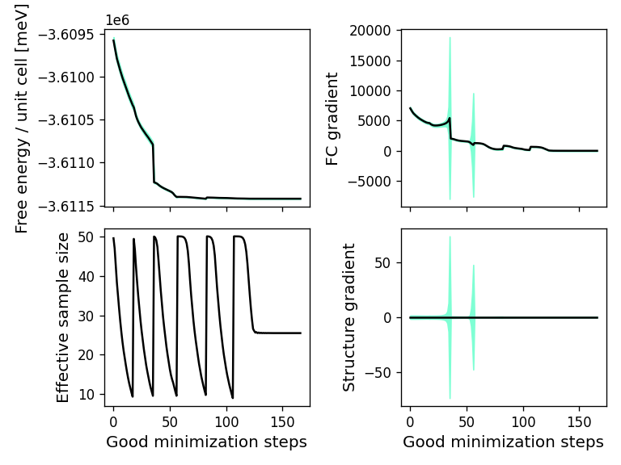
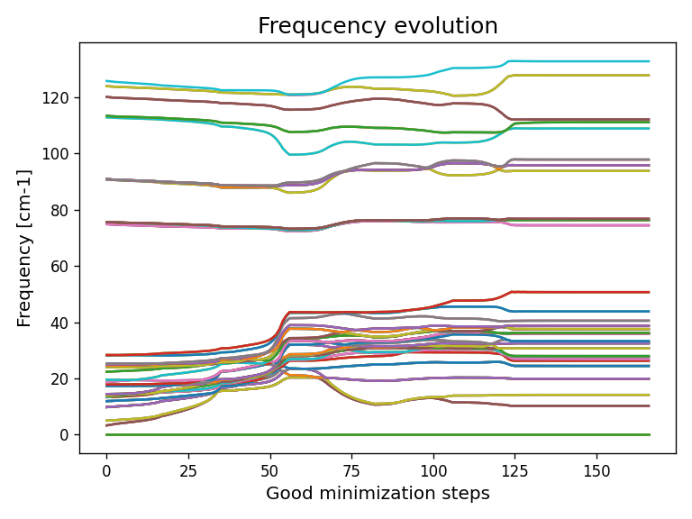
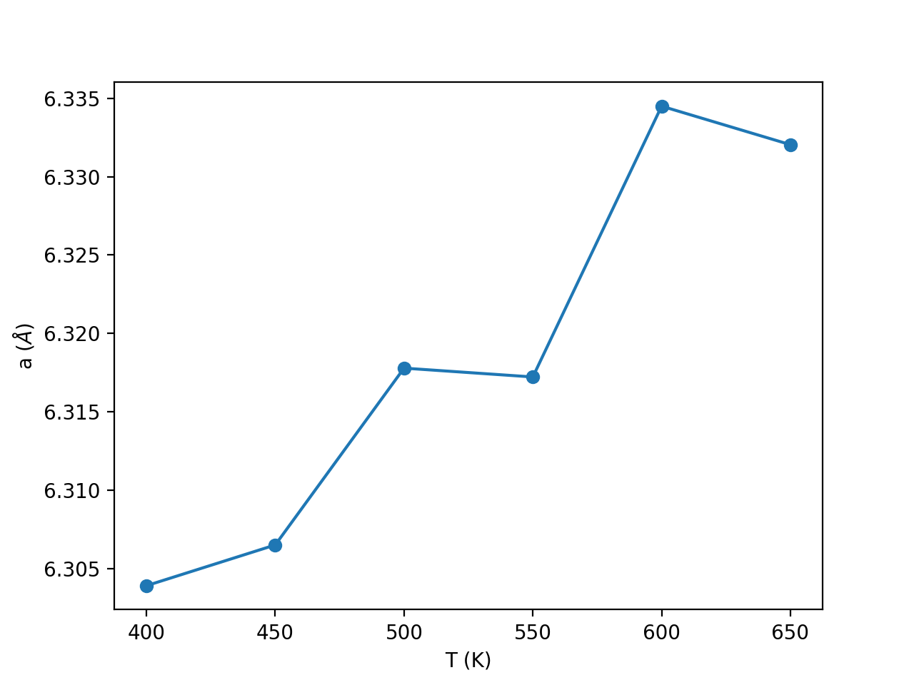

# Hands-on Session 1 - First SSCHA Simulations: Free Energy and Structural Relaxations

In this hands-on session, we provide few simple examples of how to use the SSCHA code for its most basic calculations: free energy calculations and structural relaxations considering anharmonic effects. The example will be based on calculations performed using a GAP machine learning potential for the $Pm-3m$ phase of $CsPbI_3$ perovskite structure.

The variational minimization of the free energy within the SSCHA requires several steps:

- Define a starting crystal structure with definite positions to start the minimization of the free energy assuming ionic wave functions are centeres at these positions.
- Define starting auxiliary force constants in a supercell as starting force constants for the minimization of the free energy. Even if this is not necessary, usually harmonic force constants are a good starting point.
- Create random ionic positions in the chosen supercell based on the probability distribution function defined by the initial positions and force constants.
- Calculate Born-Oppenheimer (BO) total energies, BO atomic forces, and BO lattice stresses for all these configurations. This has to be done with an external code independent of the SSCHA. The theory level used for these calculations (DFT, Monte Carlo, Empirical Force Field, Machine Learning potential...) determined the theory level behid the SSCHA.
- Perform the minimization of the free energy, optimizing the atomic positions (centers of the SSCHA  ionic wave functions) and auxiliary force constants.
- The minimization will stop if the minimum of the free energy is found within the determined threshold or if the calculation has gone out of the statistical save range.
- In the latter case, one should restart the calculation by creating a new set of configurations using as input the obtained positions and auxiliary force constants in the previous run. The process should be repeated until convergence is found.

In this tutorial we will show how to perform such calculations, starting from the most basic usage of the code to more advanced automatic type of calculations.

##  A standard manual calculation with an external force engine

The starting ionic (centroid) positions and force constants are read by the SSCHA from Quantum Espresso dynamical matrix files. We provide some harmonic calculations for $CsPbI_3$ in the folder `sscha_school_2026/Materials/CsPbI3_cubic_harmonic_*`. In these files the structure of the crystal is given, and each of the files corresponds to the force constants matrix obtained in reciprocal space for all the irreducible q points in a $2 \times 2 \times 2$ grid. In this case there are 4 different q points in the irreducible grid. This is enough to create the force constants in a commensurate $2 \times 2 \times 2$ supercell.

In this first example we will do all the steps of the SSCHA minimization separately, one by one. In the first step we will read the input positions and force constants from the harmonic dynamical matricesand create 50 random configurations based on probability distribution functions defined by these positions and force constants. This is done by the stript `sscha_school_2026/Tutorials/01-Free_Energy_Structural_Relaxations/create_configurations.py`, which is copied here:

```python
# Import cellconstructor needed things
import cellconstructor as CC
import cellconstructor.Phonons

# Import the modules to run the sscha
import sscha, sscha.Ensemble, sscha.SchaMinimizer
import sscha.Relax, sscha.Utilities

#----------------------------------------------
# We set up the parameters for the calculation

# The temperature for the calculation in K
TEMPERATURE = 450

# We tell the system that we are goin to create the configurations
# of the first population. This is just used for labeling purposes.
POPULATION = 1

# We determine the number of configurations that we will generate
# for this population
N_RANDOM = 50

# We tell where the starting dynamical matrices in reciprocal space are
# for the q points commensurate with the supercell we want to use for
# the calculation. These dynamical matrices should be in Quantum Espresso
# format.
START_DYN = "../../Materials/CsPbI3_cubic_harmonic_"
# In case we want to create the configurations from the result of a previous minimimization we ca use this starting dynamcial matrices
#START_DYN = namefile='dyn_end_population'+str(POPULATION-1)+'_'
#
# We indicate how many irreducible q points are there for the q points in the grid.
NQIRR = 4

#----------------------------------------------

# Step 1: load the harmonic dynamical matrices and the crystal structure

dyn = CC.Phonons.Phonons(START_DYN, NQIRR) # Load them and read the structure
dyn.ForcePositiveDefinite()                # Force positive phonons in case there are imaginary phonon frequencies
dyn.Symmetrize()                           # Impose symmetries and the acoustic sum rule

# Step 2: create the ensemble, the configurations for which we have to calculate the
# forces, energies and stresses

ensemble = sscha.Ensemble.Ensemble(dyn, TEMPERATURE)
ensemble.generate(N_RANDOM)

# Step 3: We save the ensemble

namefile='population'+str(POPULATION)+'_ensemble' # Name of the folder to store the ensemble
ensemble.save(namefile, POPULATION)
```

After running thie python script as
```bash
python create_configurations.py
```
we will obtain a folder with the name `population1_ensemble`, where files `u_population1_*.dat` and `scf_population1_*.dat` are stored. In the former how much atom is displaced from the starting positions is given in Bohr units and in the latter positions and lattice vectors in the supercell with the corresponding displacement  ready to be used in DFT calculations are given. This run will aslo produce `dyn_start_population1_*` dynamical matrices, which are those used to create the configurations, basically the input ones with positive frequencies and ASR forced.

The next step is to calculate the BO total energies, BO atomic forces and BO stresses for all these configurations. These has to be stored in the folder `population1_ensemble` with names `energies_supercell_population1.dat`, where all energiescalculated in the supercell  in Ry are concatanated; `forces_population1_*.dat`, where in each file the forces of the atoms are given in Ry/Bohr (one line per atom with Cartesian coordinates in the same line); and `pressure_population1_*.dat`, where in each file the $3 \times 3$ stress tensor is given in Ry/Bohr^3. These calculations can be done externally with any code and prepare these files a posteriori.

In this case we perform the calculations with the GAP machine learning potential given in `sscha_school_2026/Materials/`. This is the python script `sscha_school_2026/Tutorials/01-Free_Energy_Structural_Relaxations/run_force_energy_engine.py` that does that:

```python
# Import cellconstructor needed things
import cellconstructor as CC
import cellconstructor.Phonons

# Import the modules to run the sscha
import sscha, sscha.Ensemble, sscha.SchaMinimizer
import sscha.Relax, sscha.Utilities

# Import the module to be able to run the ML potential
from quippy.potential import Potential

# Import ASE for reading data
import ase

#----------------------------------------------
# We set up the parameters for the calculation

# The temperature for the calculation in K
TEMPERATURE = 450

# We tell the system that we are goin to create the configurations
# of the first population. This is just used for labeling purposes.
POPULATION = 1

# We determine the number of configurations that we will generate
# for this population
N_RANDOM = 50

# We define the dynamical matrices that generated the ensemble and the folder where
# the ensemble is stored
START_DYN = 'dyn_start_population'+str(POPULATION)+'_'
folder_with_ensemble = 'population'+str(POPULATION)+'_ensemble'
NQIRR = 4

# We dertermine the potential to be used
POTENTIAL ='../../Materials/GAP_1.xml'
calc = Potential("IP GAP", param_filename=POTENTIAL)

#----------------------------------------------

# We define numbers for the change of units between ASE and SSCHA
RyToEv = 13.605693
BohrToAngstrom = 0.529177

# We perform the calculations and write the results in the appropriate files with the appropriate units
energy_file=str(folder_with_ensemble)+'/energies_supercell_population'+str(POPULATION)+'.dat'
with open(energy_file, "w") as f_energy:

    struct = CC.Structure.Structure()
    for i in range(N_RANDOM):
        namefile=str(folder_with_ensemble)+'/scf_population'+str(POPULATION)+'_'+str(i+1)+'.dat'
        struct.read_scf(namefile)
        ase_struct = struct.get_ase_atoms()
        ase_struct.set_calculator(calc)
        energy = ase_struct.get_potential_energy()
        forces = ase_struct.get_forces()
        stress = ase_struct.get_stress()

        # --- Write energy in Ry ---
        f_energy.write(f"{energy/RyToEv:.10f}\n")

        # --- Write forces file in Ry/Bohr ---
        forces_file = str(folder_with_ensemble)+'/forces_population'+str(POPULATION)+'_'+str(i+1)+'.dat'
        with open(forces_file, "w") as f_forces:
            for f in forces:
                f_forces.write(f"{f[0]* (BohrToAngstrom / RyToEv):.10f} {f[1]* (BohrToAngstrom / RyToEv):.10f} {f[2]* (BohrToAngstrom / RyToEv):.10f}\n")

        # --- Write stress file in Ry/Bohr^3 ---
        stress_file = str(folder_with_ensemble)+'/pressure_population'+str(POPULATION)+'_'+str(i+1)+'.dat'
        with open(stress_file, "w") as f_stress:
            # ASE gives 6 components: xx yy zz yz xz xy
            f_stress.write(f"{stress[0]* (BohrToAngstrom**3 / RyToEv)}  {stress[5]* (BohrToAngstrom**3 / RyToEv)} {stress[4]* (BohrToAngstrom**3 / RyToEv)}\n")
            f_stress.write(f"{stress[5]* (BohrToAngstrom**3 / RyToEv)}  {stress[1]* (BohrToAngstrom**3 / RyToEv)} {stress[3]* (BohrToAngstrom**3 / RyToEv)}\n")
            f_stress.write(f"{stress[4]* (BohrToAngstrom**3 / RyToEv)}  {stress[3]* (BohrToAngstrom**3 / RyToEv)} {stress[2]* (BohrToAngstrom**3 / RyToEv)}\n")
```

After running thie python script as
```bash
python run_force_energy_engine.py
```
in the `population1_ensemble` folder we will obtain all the energies, forces and stresses that the SSCHA needs for the minimization. If an external code is done for this part, one should prepare these files externally.

With all these files ready, the variational minimization is ready to be done. We will do that with the script `sscha_school_2026/Tutorials/01-Free_Energy_Structural_Relaxations/minimize.py`:

```python
from __future__ import print_function
from __future__ import division
import sys,os

import warnings

# Import cellconstructor needed things
import cellconstructor as CC
import cellconstructor.Phonons

# Import the modules to run the sscha
import sscha, sscha.Ensemble, sscha.SchaMinimizer
import sscha.Relax, sscha.Utilities

# Import the module to be able to run the ML potential
from quippy.potential import Potential

# Import ASE for reading data
import ase

# Import matplotlib and numpy
import matplotlib
import matplotlib.pyplot as plt
from matplotlib import colors as mcolors
from matplotlib import cm
import numpy as np

# NumPy moved ComplexWarning in newer versions. This block keeps the script
# compatible with both older and newer NumPy releases.
try:
    ComplexWarning = np.exceptions.ComplexWarning
except AttributeError:
    ComplexWarning = np.ComplexWarning

warnings.filterwarnings("ignore", category=ComplexWarning)

#----------------------------------------------
# We set up the parameters for the calculation

# The temperature for the calculation in K
TEMPERATURE = 450

# We tell the system that we are goin to create the configurations
# of the first population. This is just used for labeling purposes.
POPULATION = 1

# We determine the number of configurations that we will generate
# for this population
N_RANDOM = 50

# We define the dynamical matrices that generated the ensemble and the folder where
# the ensemble is stored
START_DYN = 'dyn_start_population'+str(POPULATION)+'_'
folder_with_ensemble = 'population'+str(POPULATION)+'_ensemble'
NQIRR = 4
dyn = CC.Phonons.Phonons(START_DYN, NQIRR)

# We dertermine the potential to be used
POTENTIAL ='../../Materials/GAP_1.xml'
calc = Potential("IP GAP", param_filename=POTENTIAL)

# We load the ensemble and read the results of the configurations
ensemble = sscha.Ensemble.Ensemble(dyn, TEMPERATURE)
ensemble.load(folder_with_ensemble, population = POPULATION, N = N_RANDOM)
ensemble.has_stress = True

# Define the minimization

minimizer = sscha.SchaMinimizer.SSCHA_Minimizer(ensemble)

# Define the steps for the centroids and the force constants

minimizer.min_step_dyn = 0.005         # The minimization step on the dynamical matrix
minimizer.min_step_struc = 0.05        # The minimization step on the structure
minimizer.kong_liu_ratio = 0.2         # The parameter that estimates whether the ensemble is still good
minimizer.meaningful_factor = 0.000001 # How much small the gradient should be before I stop?

# Let's start the minimization

minimizer.init()
minimizer.run()

# Save the minimization details
ioinfo = sscha.Utilities.IOInfo()
ioinfo.SetupSaving("minim_{}".format(POPULATION))


minimizer.run(custom_function_post = ioinfo.CFP_SaveAll)
minimizer.finalize()
namefile='dyn_end_population'+str(POPULATION)+'_'
minimizer.dyn.save_qe(namefile)
```

This script can be run as
```bash
python minimize.py > population1.log
```
The evolution of the minimization can be seen in the `population1.log` file, where in the end we will see why the minimization stopped, the obtained free energy in the unit cell, the gradients of the free energy, effective Kong-Liu sampling, the force on the centroids, and the stress tensor. The minimization probably stopped because the statistical sampling worsened beyond the input criteria. The obtained auxiliary dynamical matrices and positions are stored in the files `dyn_end_population1_*`.

> **Exercise:**
>
> Considering that the minimization stopped because it got out of the statistical range, perform a new minimization step (population = 2) starting from the output of the first minimization.

##  An automatic calculation for fixed lattice parameters

The manual calculations explained before can be easy if not many populations are needed to converge the result and we have no option but performing the energy-force calculations externally, for instance in a cluster. However, with force fields or Machine Learning potentials the SSCHA can make all the process above automatically, population after population, in one single script. This can be done by making use of the relax feature of the SSCHA. An example can be done with the following script `sscha_school_2026/Tutorials/01-Free_Energy_Structural_Relaxations/sscha_relax.py`:

```python
import cellconstructor as CC, cellconstructor.Phonons
import sscha, sscha.Ensemble, sscha.SchaMinimizer
import sscha.Relax

from quippy.potential import Potential

import sys, os

import ase
import numpy as np

import warnings

# NumPy moved ComplexWarning in newer versions. This block keeps the script
# compatible with both older and newer NumPy releases.
try:
    ComplexWarning = np.exceptions.ComplexWarning
except AttributeError:
    ComplexWarning = np.ComplexWarning

warnings.filterwarnings("ignore", category=ComplexWarning)

TEMPERATURE = 450 # K
NQIRR = 4
START_DYN = "../../Materials/CsPbI3_cubic_harmonic_"
POTENTIAL = "../../Materials/GAP_1.xml"
N_CONFIGS = 50


# Load the harmonic dynamical matrix
dyn = CC.Phonons.Phonons(START_DYN, NQIRR)

# Force positive phonons
dyn.ForcePositiveDefinite()

# Impose symmetries and ASR
dyn.Symmetrize()

# Load the interatomic Potential for CsPbI3
calc = Potential("IP GAP", param_filename=POTENTIAL)

# Run the sscha
ensemble = sscha.Ensemble.Ensemble(dyn, TEMPERATURE)
minimizer = sscha.SchaMinimizer.SSCHA_Minimizer(ensemble)
minimizer.meaningful_factor = 0.000001
minimizer.set_minimization_step(0.001)
minimizer.kong_liu_ratio = 0.2
relax = sscha.Relax.SSCHA(minimizer, calc, N_configs = N_CONFIGS)

# Setup to save the minimization details every good minimization step
# Allows to plot minimization results
ioinfo = sscha.Utilities.IOInfo()
ioinfo.SetupSaving("minimization_data")
relax.setup_custom_functions(custom_function_post = ioinfo.CFP_SaveAll)

relax.relax()

# Save the final ensemble
relax.minim.ensemble.save_bin("data", 1)
relax.minim.dyn.save_qe("sscha_auxiliary_dyn_")
```

This script can be run as: 
```bash
python sscha_relax.py > sscha_relax.log
```
With this script the minimization continues until the gadients of the free energy become smaller than the input value, realtive to the error. In this case, the final dynamical matrices are stored in `sscha_auxiliary_dyn_`. The evolution of the minimization can be visualized more clearly using the following command
```bash
sscha-plot-data minimization_data
```
by plotting the evolution of the minimizaton stored in the files `minimization_data.freqs` and `minimization_data.dat`. We should get something like:
{ width=70% }
{ width=70% }

Be careful that the number of configurations used is rather low and one should check convergence with respect to the number of configurations. One way of checking that is by running a final new step with more configurations starting from the result obtained at the end of the minimization.

##  An automatic calculation relaxing also the lattice parameters

Even if the automatic calculation simplifies the procedure enormously, the SSCHA can further simplify the calculations by relaxing also the lattice parameters to a target pressure. This is done by replacing the relax feature by the vcrelax one as shown in the `sscha_school_2026/Tutorials/01-Free_Energy_Structural_Relaxations/sscha_vcrelax.py` script:

```python
import cellconstructor as CC, cellconstructor.Phonons
import sscha, sscha.Ensemble, sscha.SchaMinimizer
import sscha.Relax

from quippy.potential import Potential

import sys, os

import ase
import numpy as np

import warnings

# NumPy moved ComplexWarning in newer versions. This block keeps the script
# compatible with both older and newer NumPy releases.
try:
    ComplexWarning = np.exceptions.ComplexWarning
except AttributeError:
    ComplexWarning = np.ComplexWarning

warnings.filterwarnings("ignore", category=ComplexWarning)

TEMPERATURE = 450 # K
NQIRR = 4
START_DYN = "../../Materials/CsPbI3_cubic_harmonic_"
POTENTIAL = "../../Materials/GAP_1.xml"
N_CONFIGS = 50


# Load the harmonic dynamical matrix
dyn = CC.Phonons.Phonons(START_DYN, NQIRR)

# Force positive phonons
dyn.ForcePositiveDefinite()

# Impose symmetries and ASR
dyn.Symmetrize()

# Load the interatomic Potential for CsPbI3
calc = Potential("IP GAP", param_filename=POTENTIAL)

# Run the sscha
ensemble = sscha.Ensemble.Ensemble(dyn, TEMPERATURE)
minimizer = sscha.SchaMinimizer.SSCHA_Minimizer(ensemble)
minimizer.meaningful_factor = 0.000001
minimizer.set_minimization_step(0.001)
minimizer.kong_liu_ratio = 0.2
relax = sscha.Relax.SSCHA(minimizer, calc, N_configs = N_CONFIGS)

# Setup to save the minimization details every good minimization step
# Allows to plot minimization results
ioinfo = sscha.Utilities.IOInfo()
ioinfo.SetupSaving("minimization_data")
relax.setup_custom_functions(custom_function_post = ioinfo.CFP_SaveAll)

# We perform a variable cell relaxation with the target pressure in GPaf
relax.vc_relax(target_press = 0)

# Save the final ensemble
relax.minim.ensemble.save_bin("data", 1)
relax.minim.dyn.save_qe("sscha_auxiliary_dyn_")
```
This script can be run as: 
```bash
python sscha_vcrelax.py > sscha_vcrelax.log
```
The final auxiliary dynamical matrices in this case will correspond to a different lattice parameter as specified in the `sscha_auxiliary_dyn_` files.

> **Exercise:**
>
> Calculate the lattice parameter as a function of temperature.
>
> You should obtain something like that
> { width=70% }

> 
> As you can see the result is not very smooth although a clear positive trend is seeing. This calculation was perfomred with only 50 configurations per population. This noisy result suggests that the result can improve with more configurations.
