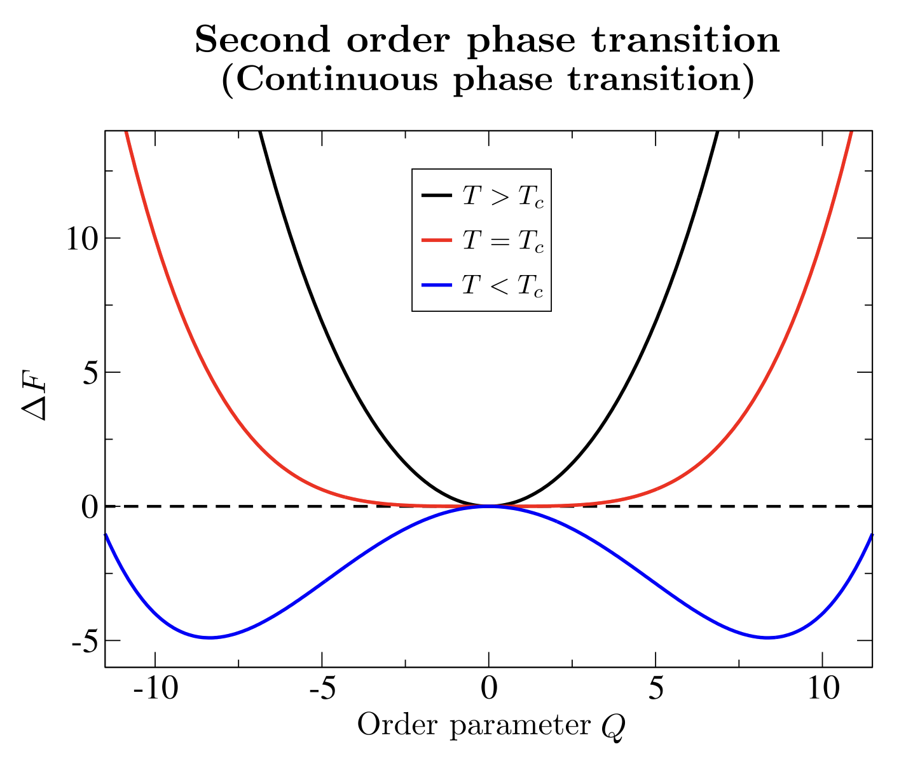
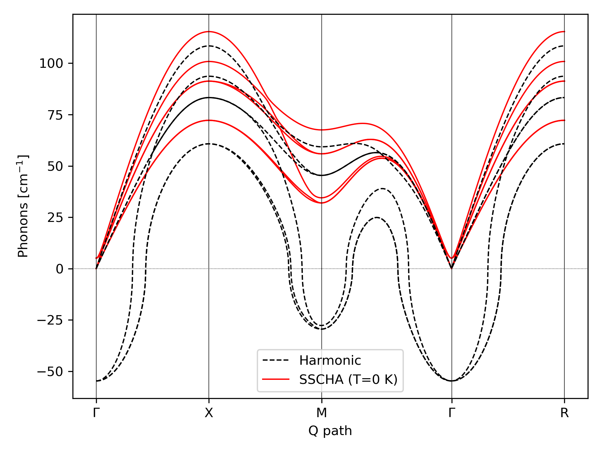
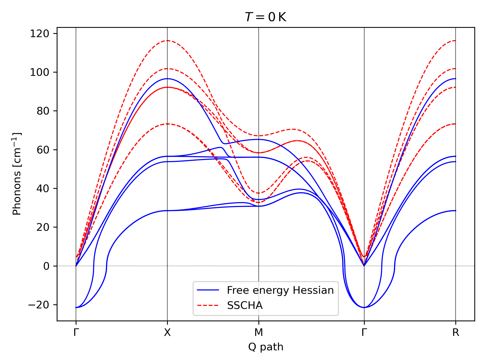
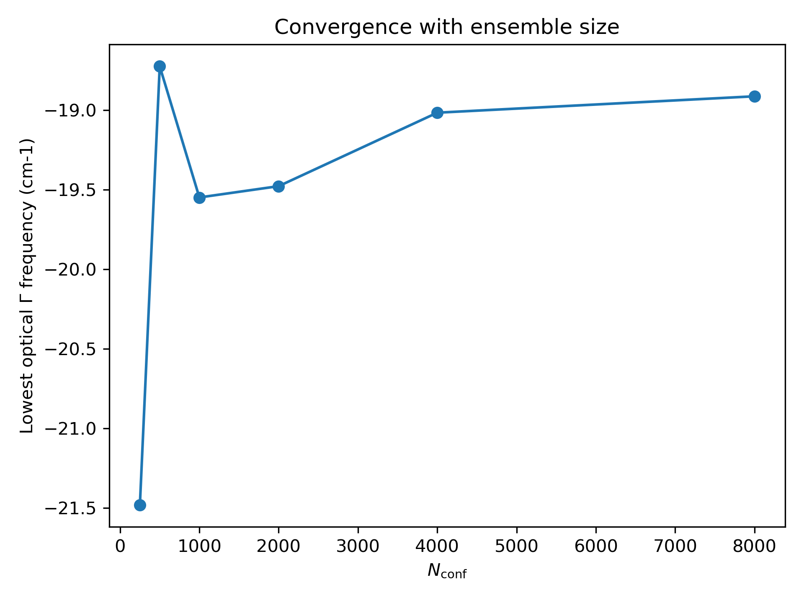
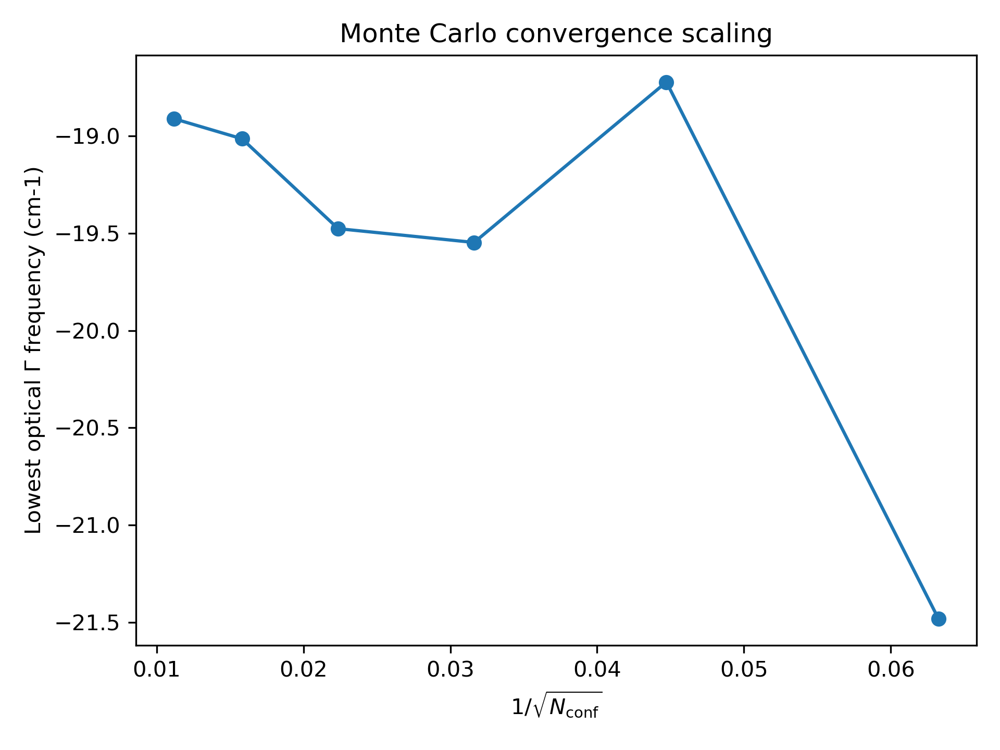
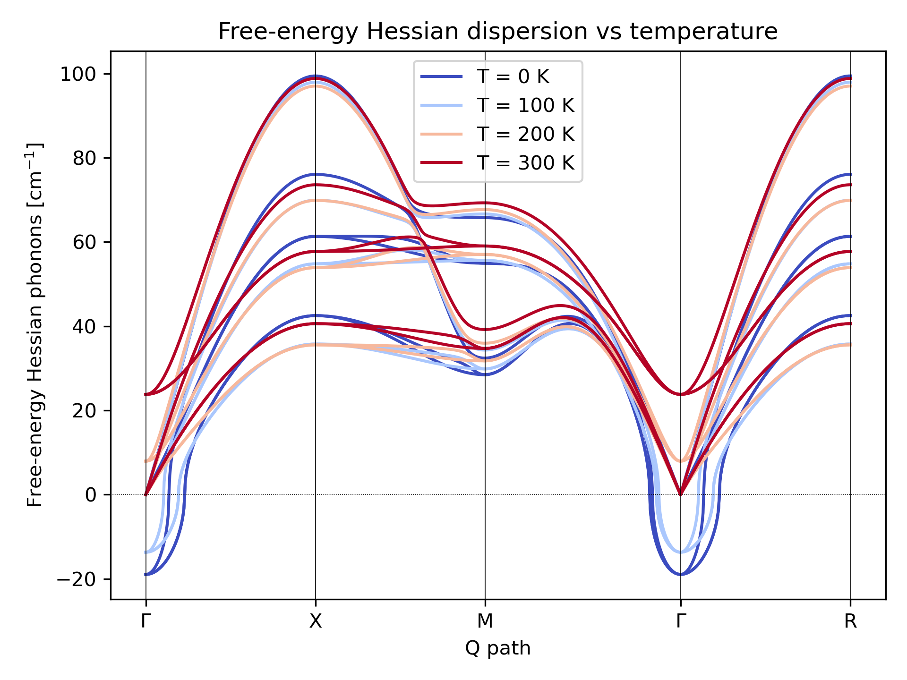
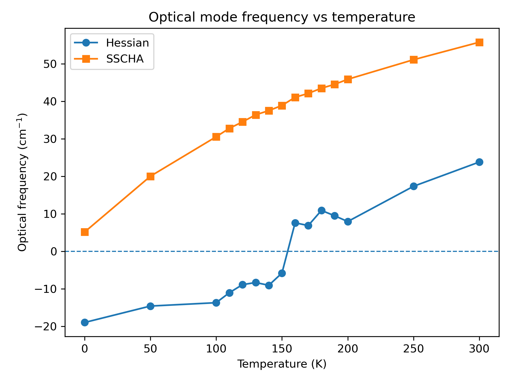
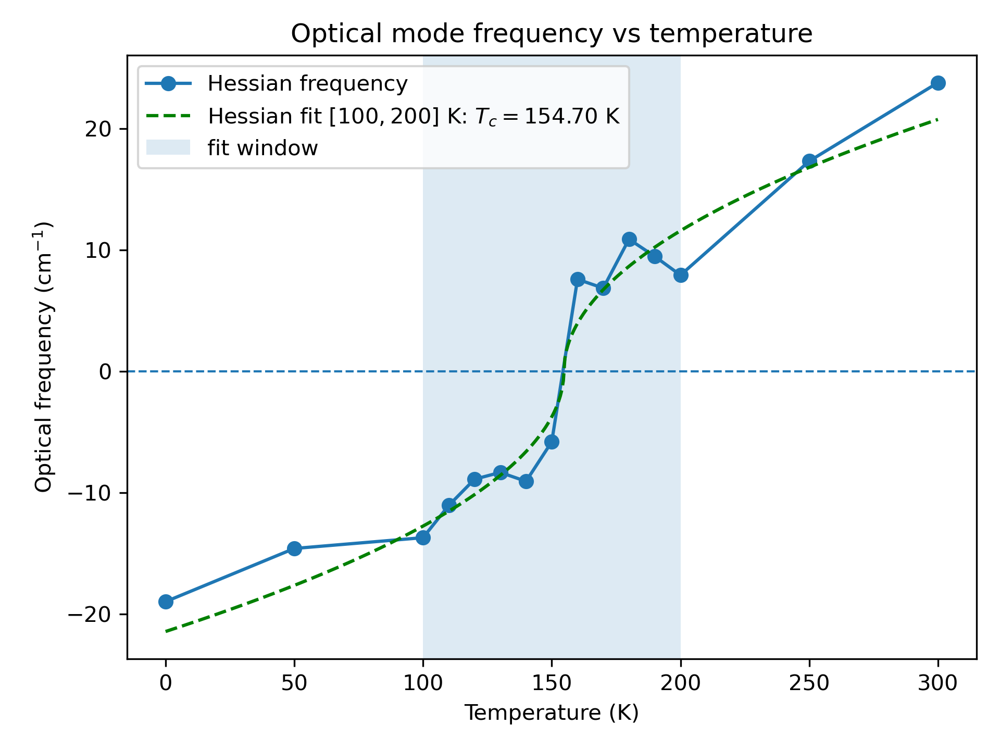
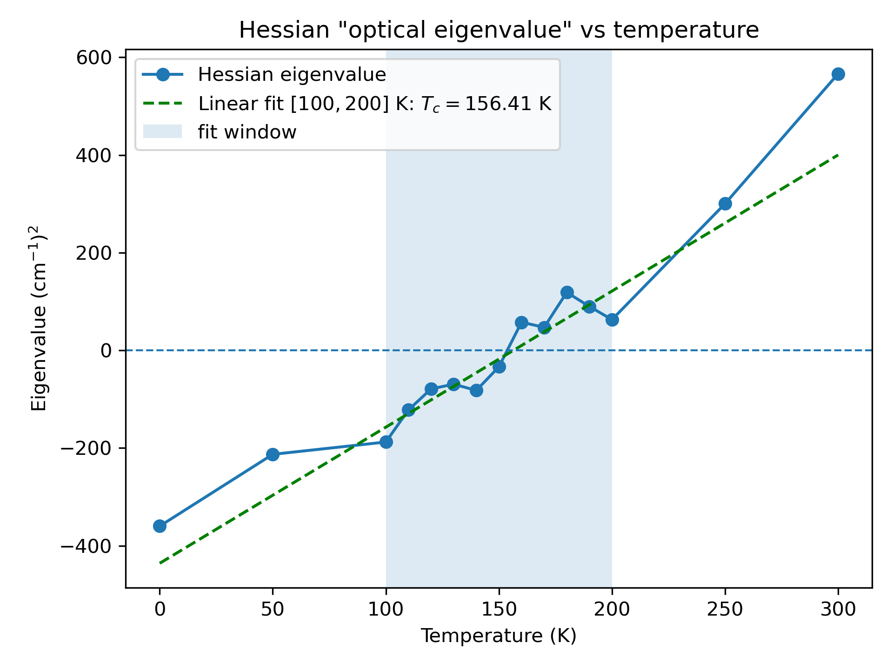

# Hands-on Session 2 - Calculating Second-Order Phase Transitions with the SSCHA

In this hands-on session, we will learn how to study second-order phase transitions using the SSCHA.

The calculations will be performed using a toy force-field model for ferroelectric transitions in FCC materials, originally introduced by Ai *et al.* [Phys. Rev. B **90**, 014308 (2014)](https://journals.aps.org/prb/abstract/10.1103/PhysRevB.90.014308). This model captures the essential physics of ferroelectric instabilities in FCC compounds while keeping the computational cost low. In the present tutorial, we will focus on the specific case of SnTe. To do so, first activate the appropriate environment and install the required package:

```bash
conda activate sscha
pip install F3ToyModel
```

The toy model requires the harmonic dynamical matrices of the system. In this tutorial, we use dynamical matrices computed from first principles on a $2 \times 2 \times 2$ q-point grid of the Brillouin zone. These are provided in the `ffield_dynq_*` files located in the `Materials/tutorial_02` directory.


## Structural Instability: Calculation of the Hessian

According to Landau theory, a second-order phase transition occurs when the curvature of the free energy around the high-symmetry structure becomes negative along the order-parameter direction:


{ width=70% }


In structural *displacive* phase transitions, the order parameter is associated with the amplitude of a collective pattern of atomic displacements that lowers the symmetry of the high-symmetry phase. The transition occurs when the free-energy curvature along this distortion pattern vanishes and eventually becomes negative.

Thus the key quantity for investigating displacive second-order phase transitions is the free-energy Hessian with respect to the centroid positions,

$$
\frac{\partial^2 F}{\partial R_a \partial R_b},
$$

where $F(R)$ is the free energy as a function of the average atomic positions (centroids).

Within the SSCHA framework, an analytical expression for the free-energy Hessian was derived by Bianco *et al.* [Phys. Rev. B **96**, 014111 (2017)](https://journals.aps.org/prb/abstract/10.1103/PhysRevB.96.014111). The free-energy Hessian (i.e. the curvature of the free-energy surface) can be expressed in compact tensor notation as

$$
\frac{\partial^2 F}{\partial R \, \partial R}
=
\Phi
+
\stackrel{(3)}{\Phi}
\Lambda
\left[
1
-
\stackrel{(4)}{\Phi}
\Lambda
\right]^{-1}
\stackrel{(3)}{\Phi},
$$

with $\Phi_{ab}$ the SSCHA force-constant matrix, which is also equal to the
statistical average of the potential-energy Hessian over the SSCHA probability distribution $\rho$ 
$$
\Phi_{ab}
=
\left\langle \frac{\partial^2 V}{\partial {R_a}\partial {R_b}}  \right\rangle_{\rho}
$$
and similarly
$$
\stackrel{(3)}{\Phi}_{abc}
=
\left\langle
\frac{\partial^3 V}{\partial R_a \partial R_b \partial R_c}
\right\rangle_{\rho},
\qquad
\stackrel{(4)}{\Phi}_{abcd}
=
\left\langle
\frac{\partial^4 V}{\partial R_a \partial R_b \partial R_c \partial R_d}
\right\rangle_{\rho}.
$$
The tensor $\Lambda_{abcd}$ depends on the eigenvalues and eigenvectors of the SSCHA dynamical matrix, $D_{ab} = {\Phi_{ab}}/{\sqrt{M_a M_b}}$.

The free-energy Hessian can be evaluated within the SSCHA framework using a stochastic approach through the function call:
```python
ensemble.get_free_energy_hessian()
```
The dynamical matrix associated with the free-energy Hessian,

$$
D^{(F)}=\frac{1}{\sqrt{M_aM_b}}
\frac{\partial^2 F}{\partial R_a \, \partial R_b},
$$

is the quantity that determines the stability of the crystal beyond the harmonic approximation, as it incorporates quantum, thermal, and anharmonic effects through the curvature of the free-energy surface.

By diagonalizing $D^{(F)}$ and tracking its eigenvalues as a function of temperature, we can identify when one of them becomes zero. This signals that the free-energy curvature vanishes along a specific direction in configuration space and therefore marks the onset of a second-order phase transition. The corresponding eigenvector defines the instability mode, i.e. the pattern of atomic displacements that lowers the free energy.

## Practical Example: The Ferroelectric Transition in SnTe

To illustrate the concepts introduced above, we now consider a practical example: the ferroelectric phase transition in SnTe.

SnTe crystallizes at room temperature and ambient pressure in the NaCl structure (space group $Fm\bar{3}m$), known as the $\beta$-SnTe phase, in which two interpenetrating fcc sublattices of Sn and Te are present. Upon cooling below approximately 100 K, SnTe undergoes a structural phase transition to a rhombohedral phase (space group $R3m$), known as the $\alpha$-SnTe phase.

The transition can be understood as a symmetry-lowering distortion of the high-symmetry cubic structure. It is commonly described as a two-step process: first, a relative polar displacement of the Sn and Te sublattices along the cubic [111] direction removes the inversion center; second, a rhombohedral strain develops along the same direction. In this tutorial, we focus exclusively on the polar distortion.

To describe this behavior, we employ a toy interatomic potential $V(u)$ expressed as a function of the atomic displacements $u_a = R_a - R_a^{\mathrm{eq}}$ from the equilibrium positions of the cubic rock-salt structure. Beyond the harmonic contribution, the model retains only third- and fourth-order anharmonic terms:

$$
V(u) =
\frac{1}{2}\sum_{ab}\phi_{ab} u^a u^b
+
\frac{1}{3!}\sum_{abc}\phi^{(3)}_{abc} u^a u^b u^c
+
\frac{1}{4!}\sum_{abcd}\phi^{(4)}_{abcd} u^a u^b u^c u^d .
$$

For the harmonic contribution $\phi_{ab}$, we use dynamical matrices computed from first principles on a $2 \times 2 \times 2$ q-point grid. The third- and fourth-order force constants are instead parametrized within the toy model. In particular, the third-order term $\phi^{(3)}_{abc}$ is controlled by a single parameter $p_3$, whereas the fourth-order term $\phi^{(4)}_{abcd}$ depends on two parameters, $p_4$ and $p_{4\chi}$. Throughout this tutorial, we use

$$
p_4 = -0.022 \,\mathrm{eV/\AA^4},
\qquad
p_{4\chi} = -0.014 \,\mathrm{eV/\AA^4},
\qquad
p_3 = 0.036475 \,\mathrm{eV/\AA^3}.
$$


The harmonic force constants $\phi_{ab}$ exhibit negative eigenvalues, indicating that the high-symmetry cubic phase is dynamically unstable within the harmonic approximation. This instability manifests itself as imaginary phonon frequencies in the harmonic phonon spectrum. As a first step, let us compute and visualize the harmonic phonon dispersion of SnTe along a high-symmetry path of the Brillouin zone (BZ) using the following script:

```python
import cellconstructor.Phonons
import cellconstructor.ForceTensor
import cellconstructor.Methods

import matplotlib.pyplot as plt

NQIRR = 3
PATH = "GXMGR"
N_POINTS = 1000

SPECIAL_POINTS = {
    "G": [0.0, 0.0, 0.0],
    "X": [0.5, 0.0, 0.0],
    "M": [0.5, 0.5, 0.0],
    "R": [0.5, 0.5, 0.5],
}

# Load HARM phonons
harm_dyn = cellconstructor.Phonons.Phonons("../../Materials/tutorial_02/ffield_dynq_", NQIRR)


# Get band path
qpath, data = cellconstructor.Methods.get_bandpath(
    harm_dyn.structure.unit_cell,
    PATH,
    SPECIAL_POINTS,
    N_POINTS)

xaxis, xticks, xlabels = data

# Fourier interpolation along q-path
harm_dispersion = cellconstructor.ForceTensor.get_phonons_in_qpath(
    harm_dyn,
    qpath)

nmodes = harm_dyn.structure.N_atoms * 3

plt.figure(dpi=150)
ax = plt.gca()

for i in range(nmodes):
    ax.plot(
        xaxis,
        harm_dispersion[:, i],
        color="r",
        lw=1)

for x in xticks:
    ax.axvline(x, 0, 1, color="k", lw=0.4)

ax.axhline(0, 0, 1, color="k", ls=":", lw=0.4)

ax.set_xticks(xticks)
ax.set_xticklabels(xlabels)

ax.set_xlabel("Q path")
ax.set_ylabel("Phonons [cm$^{-1}$]")

plt.tight_layout()
plt.savefig("harm_dispersion.png", dpi=300)
plt.show()
```

{ width=70% }

> **Question**
>
> The harmonic phonon spectrum of the high-symmetry cubic phase contains imaginary frequencies, indicating a dynamical instability. Why, then, is the cubic phase experimentally observed above the critical temperature?

> **Answer**
>
> $$
> \begin{array}{ccc}
> \textbf{Harmonic} & & \textbf{Free-energy Hessian}
> \\[0.5em]
> \boxed{\frac{1}{\sqrt{M_aM_b}}\dfrac{\partial^2 V}{\partial R_a \partial R_b}}
> &
> \mathrm{VS}
> &
> \boxed{  \frac{1}{\sqrt{M_aM_b}}    \dfrac{\partial^2 F}{\partial R_a \partial R_b}}
> \end{array}
> $$
> The harmonic approximation determines the stability of the high-symmetry structure from the curvature of the potential-energy surface.
>
>
> However, the actual stability of a crystal is determined by the curvature of the free energy rather than by the potential energy alone, with the free energy including both quantum and thermal effects:
>
> $$
> F = E - TS,
> $$
>
> where the energy is determined by the full nuclear Hamiltonian
>
> $$
> H = K + V.
> $$
>
> Therefore, quantum fluctuations arising from the kinetic-energy operator $K$ and thermal fluctuations associated with the entropic term $TS$ can stabilize the high-symmetry phase even when the 
> harmonic approximation   predicts a dynamical instability. The SSCHA accounts for these effects non-perturbatively by directly evaluating the free-energy Hessian.

## Calculation of the SSCHA Dynamical Matrix

As a first step, let us compute the SSCHA dynamical matrix for SnTe at $T = 0\,\mathrm{K}$. 
We proceed with this script:


```python
import os
import numpy as np
import warnings

# CellConstructor modules
import cellconstructor as CC
import cellconstructor.Phonons

# SSCHA modules
import sscha
import sscha.Ensemble
import sscha.SchaMinimizer
import sscha.Relax

# Toy-model force field
import fforces as ff
import fforces.Calculator


# ============================================================
# Ignore NumPy ComplexWarning generated during SSCHA updates
# ============================================================

try:
    ComplexWarning = np.exceptions.ComplexWarning
except AttributeError:
    ComplexWarning = np.ComplexWarning

warnings.filterwarnings("ignore", category=ComplexWarning)


# ============================================================
# INPUT PARAMETERS
# ============================================================

# Temperature in Kelvin
TEMPERATURE = 0

# Number of irreducible q-points
NQIRR = 3

# Number of configurations used in the SSCHA ensemble
N_CONFIGS = 126

# Prefix of the starting dynamical matrices
START_DYN = "../../Materials/tutorial_02/ffield_dynq_"

# Dynamical matrices used to define the harmonic reference of the toy model
MODEL_DYN = "../../Materials/tutorial_02/ffield_dynq_"


# ============================================================
# DEFINE THE TOY FORCE FIELD
# ============================================================

# Load the harmonic dynamical matrices
ff_dyn = CC.Phonons.Phonons(MODEL_DYN, NQIRR)

# Create the toy-model calculator
ff_calculator = ff.Calculator.ToyModelCalculator(ff_dyn)

# Select the type of anharmonic toy potential
ff_calculator.type_cal = "pbtex"

# Anharmonic parameters
ff_calculator.p3 = 0.036475
ff_calculator.p4 = -0.022
ff_calculator.p4x = -0.014


# ============================================================
# CREATE OUTPUT DIRECTORY
# ============================================================

output_dir = f"RELAX/T_{TEMPERATURE}"
os.makedirs(output_dir, exist_ok=True)


# ============================================================
# LOAD STARTING DYNAMICAL MATRICES
# ============================================================

start_dyn = CC.Phonons.Phonons(START_DYN, NQIRR)

# If the starting dynamical matrices are not positive definite
# (i.e. imaginary phonon frequencies are present),
# enforce positive definiteness and reimpose crystal symmetries
# and the acoustic sum rule.

w, pols = start_dyn.DiagonalizeSupercell()

w_sorted = np.sort(w)
tol = -1e-4

if np.min(w_sorted[3:]) < tol:
    print("Non-acoustic imaginary phonon modes detected")
    start_dyn.ForcePositiveDefinite()
    start_dyn.Symmetrize()


# ============================================================
# CREATE SSCHA ENSEMBLE
# ============================================================

ensemble = sscha.Ensemble.Ensemble(
    start_dyn,
    TEMPERATURE
)


# ============================================================
# SETUP THE SSCHA MINIMIZER
# ============================================================

minimizer = sscha.SchaMinimizer.SSCHA_Minimizer(ensemble)

# Control minimization stability and convergence
minimizer.meaningful_factor = 0.01
minimizer.set_minimization_step(0.001)


# ============================================================
# SETUP SSCHA RELAXATION
# ============================================================

relax = sscha.Relax.SSCHA(
    minimizer,
    ase_calculator=ff_calculator,
    N_configs=N_CONFIGS
)


# ============================================================
# RUN THE SSCHA MINIMIZATION
# ============================================================

relax.relax()


# ============================================================
# SAVE FINAL SSCHA DYNAMICAL MATRICES
# ============================================================

relax.minim.dyn.save_qe(
    os.path.join(output_dir, "sscha_dyn_")
)
```
In this way, by minimizing the free energy, we obtain the SSCHA dynamical matrices. Plotting the phonon dispersion of the SSCHA dynamical matrices together with the harmonic phonon dispersion, we obtain the following result.

{ width=70% }

By definition, the SSCHA dynamical matrices are positive definite. As a consequence, structural instabilities cannot be detected directly from their eigenvalues. To assess the stability of the high-symmetry phase, we must compute the free-energy Hessian.

The computation of $\stackrel{(4)}{\Phi}$ is significantly more expensive than that of $\stackrel{(3)}{\Phi}$, both in terms of CPU time and memory consumption. For this reason, in this tutorial we adopt the so-called *bubble approximation*,

$$
\frac{\partial^2 F}{\partial R \, \partial R}
\simeq
\Phi
+
\stackrel{(3)}{\Phi}
\Lambda
\stackrel{(3)}{\Phi}.
$$

Although the terms beyond the bubble approximation can be included in principle, they are often found to be negligible in practice. Nevertheless, their importance should always be assessed on a case-by-case basis.

## Calculation of the Free-Energy Hessian

We now evaluate the free-energy Hessian at $T = 0\,\mathrm{K}$ using the following script:

```python
import os
import numpy as np
import warnings

import cellconstructor as CC
import cellconstructor.Phonons

import sscha.Ensemble
import sscha.SchaMinimizer
import sscha.Relax

import fforces as ff
import fforces.Calculator


# ============================================================
# Ignore NumPy ComplexWarning generated during SSCHA updates
# ============================================================

try:
    ComplexWarning = np.exceptions.ComplexWarning
except AttributeError:
    ComplexWarning = np.ComplexWarning

warnings.filterwarnings("ignore", category=ComplexWarning)


# ============================================================
# INPUT PARAMETERS
# ============================================================

TEMPERATURE = 0
NQIRR = 3


# Number of configurations used for this first illustrative Hessian calculation.
# (A larger ensemble than that used in the SSCHA relaxation is
#  generally required to compute the free-energy Hessian accurately).
N_CONFIGS = 250
# A convergence study with respect to this parameter will be performed below.

# Already relaxed SSCHA dynamical matrices
SSCHA_DYN = f"RELAX/T_{TEMPERATURE}/sscha_dyn_"

# Dynamical matrices defining the harmonic part of the toy model
MODEL_DYN = "../../Materials/tutorial_02/ffield_dynq_"

# Output directory for the free-energy Hessian dynamical matrices
OUTPUT_DIR = f"HESSIAN/T_{TEMPERATURE}"
os.makedirs(OUTPUT_DIR, exist_ok=True)


# ============================================================
# DEFINE THE TOY FORCE FIELD
# ============================================================

ff_dyn = CC.Phonons.Phonons(MODEL_DYN, NQIRR)

ff_calculator = ff.Calculator.ToyModelCalculator(ff_dyn)
ff_calculator.type_cal = "pbtex"

ff_calculator.p3 = 0.036475
ff_calculator.p4 = -0.022
ff_calculator.p4x = -0.014


# ============================================================
# LOAD RELAXED SSCHA DYNAMICAL MATRICES
# ============================================================

sscha_dyn = CC.Phonons.Phonons(SSCHA_DYN, NQIRR)
sscha_dyn.Symmetrize()


# ============================================================
# CREATE SSCHA ENSEMBLE
# ============================================================

ensemble = sscha.Ensemble.Ensemble(
    sscha_dyn,
    TEMPERATURE
)


# ============================================================
# SETUP THE SSCHA MINIMIZER
# ============================================================

minimizer = sscha.SchaMinimizer.SSCHA_Minimizer(ensemble)
minimizer.meaningful_factor = 0.01
minimizer.set_minimization_step(0.001)


# ============================================================
# SETUP SSCHA RELAXATION
# ============================================================

relax = sscha.Relax.SSCHA(
    minimizer,
    ase_calculator=ff_calculator,
    N_configs=N_CONFIGS
)


# ============================================================
# REFINE THE SSCHA DYNAMICAL MATRIX WITH A LARGER ENSEMBLE
# ============================================================

relax.relax()

relax.minim.dyn.save_qe(
    os.path.join(OUTPUT_DIR, "refined_sscha_dyn_")
)


# ============================================================
# COMPUTE THE FREE-ENERGY HESSIAN
# ============================================================

# Reweight the ensemble using the refined dynamical matrix
ensemble.update_weights(minimizer.dyn, TEMPERATURE)

dyn_hessian = ensemble.get_free_energy_hessian(
    include_v4=False,       # bubble approximation
    get_full_hessian=True,  # full free-energy Hessian
    return_d3=False,        # do not save third-order SSCHA force constants
)


# ============================================================
# SAVE THE FREE-ENERGY HESSIAN DYNAMICAL MATRICES
# ============================================================

dyn_hessian.save_qe(
    os.path.join(OUTPUT_DIR, "hessian_dyn_")
)

print("\nDone.")
```

We can now compute the phonon dispersion corresponding to the free-energy Hessian dynamical matrix $D^{(F)}$ and compare it with the SSCHA phonon dispersion.

> **Exercise**
>
> Compute and plot the phonon dispersion associated with the free-energy Hessian dynamical matrix $D^{(F)}$ along a high-symmetry path of the Brillouin zone. Compare the result with the corresponding SSCHA phonon dispersion.


{ width=70% }

An instability is observed in the optical mode at the $\Gamma$ point, indicating the expected ferroelectric distortion. In contrast, no instability is found at the $M$ point.

> **Question**
>
> The harmonic phonon spectrum exhibits instabilities at both the $\Gamma$ and $M$ points. Why does the instability at $M$ disappear in the free-energy Hessian spectrum?

> **Answer**
>
> The harmonic approximation determines the stability of the crystal from the curvature of the potential-energy surface alone. The free-energy Hessian, on the other hand, includes the effects of quantum and thermal fluctuations through the free energy.
>
> In particular, even at zero temperature, quantum fluctuations associated with the zero-point motion modify the free-energy curvature. In SnTe, these quantum effects are strong enough to stabilize the distortion pattern associated with the $M$-point instability, making the corresponding free-energy Hessian eigenvalue positive. The ferroelectric instability at $\Gamma$, however, remains unstable and therefore continues to drive the phase transition.

Before drawing quantitative conclusions, however, we must verify that the free-energy Hessian is converged with respect to the number of configurations used in its stochastic evaluation. Indeed, the bubble correction depends on the third-order force-constant tensor, $\stackrel{(3)}{\Phi}$, whose statistical estimation generally requires a larger ensemble than that needed for the SSCHA minimization itself.


A convergence study with respect to the ensemble size is therefore essential.

> **Exercise**
>
> Compute the optical eigenvalue of the free-energy Hessian dynamical matrix $D^{(F)}$ as a function of the number of configurations $N_{\mathrm{conf}}$ used in the stochastic evaluation of the Hessian.

{ width=70% }

In Monte Carlo calculations, the statistical uncertainty decreases approximately as

$$
\frac{1}{\sqrt{N_{\mathrm{conf}}}}.
$$

For this reason, convergence studies are often analyzed as a function of $1/\sqrt{N_{\mathrm{conf}}}$.

> **Exercise**
>
> Replot the soft-mode frequency as a function of $1/\sqrt{N_{\mathrm{conf}}}$.

{ width=70% }

The convergence test shows that increasing the ensemble size beyond approximately 1000 configurations changes the estimated frequency by less than about $1\,\mathrm{cm}^{-1}$. For most practical purposes, further reducing the stochastic error is of limited value, as other sources of uncertainty—such as the choice of pseudopotentials, exchange-correlation functional, supercell size, or the accuracy of the underlying force field—typically dominate the overall error budget.

Nevertheless, since the toy-model calculations are computationally inexpensive, we can afford to use larger ensembles. In the following, we therefore adopt $N_{\mathrm{conf}} = 4000$, which further reduces the statistical uncertainty of the free-energy Hessian, especially in the vicinity of the phase transition.

Once the number of configurations required to obtain a converged free-energy Hessian has been determined, we can perform a systematic study as a function of temperature.

As a first step, we compute the phonon dispersion associated with the free-energy Hessian at several temperatures.

> **Exercise**
>
> Compute the phonon dispersion associated with the free-energy Hessian at several temperatures and estimate the temperature range in which the phase transition occurs.

{ width=70% }

As the temperature decreases, the optical mode at the $\Gamma$ point progressively softens and eventually becomes unstable. From these dispersions, it is already possible to obtain a rough estimate of the critical temperature, which appears to lie between 100 and 200 K.

To determine the transition temperature more accurately, it is convenient to focus on the soft optical mode at the $\Gamma$ point and follow its frequency as a function of temperature.

> **Exercise**
>
> Compute the frequency of the soft optical mode at $\Gamma$ as a function of temperature using both the SSCHA dynamical matrix and the free-energy Hessian dynamical matrix. Compare the temperature evolution of the two quantities.

{ width=70% }

The figure clearly highlights the different physical meaning of the two quantities. While the frequency obtained from the free-energy Hessian eventually becomes imaginary, signaling a structural instability, the SSCHA frequency remains real at all temperatures. This is expected, since the SSCHA auxiliary dynamical matrix is positive definite by construction and therefore cannot directly exhibit unstable modes.

As the temperature decreases, the free-energy Hessian mode softens continuously and eventually crosses zero. The corresponding temperature identifies the onset of the ferroelectric instability.

> **Question**
>
> What temperature dependence is expected for the soft-mode frequency close to a second-order phase transition?
>
> **Answer**
>
> Within a mean-field description of a second-order phase transition, the soft-mode frequency is expected to satisfy
>
> $$
> \omega^2(T) \propto T - T_c.
> $$
>
> Equivalently,
>
> $$
> \omega(T) \propto \sqrt{T-T_c}.
> $$
>
> Therefore, close to the transition, the frequency is expected to follow a square-root dependence on temperature.

> **Exercise**
>
> Fit the temperature dependence of the soft-mode frequency using the expected square-root behavior and estimate the critical temperature.

{ width=70% }

The square-root fit already provides a reasonable estimate of the critical temperature. However, extracting $T_c$ from a non-linear fit can be sensitive to statistical fluctuations.

Since mean-field theory predicts a linear dependence of $\omega^2$ on temperature, it is often more convenient to analyze the squared frequency instead.

> **Exercise**
>
> Plot the squared frequency of the soft mode obtained from the free-energy Hessian as a function of temperature. Perform a linear fit and estimate the critical temperature $T_c$.

{ width=70% }

The linear dependence predicted by mean-field theory is clearly observed. The temperature at which the fitted line crosses zero provides an estimate of the critical temperature.

The linear fit yields

$$
T_c \simeq 150\,\mathrm{K}.
$$


