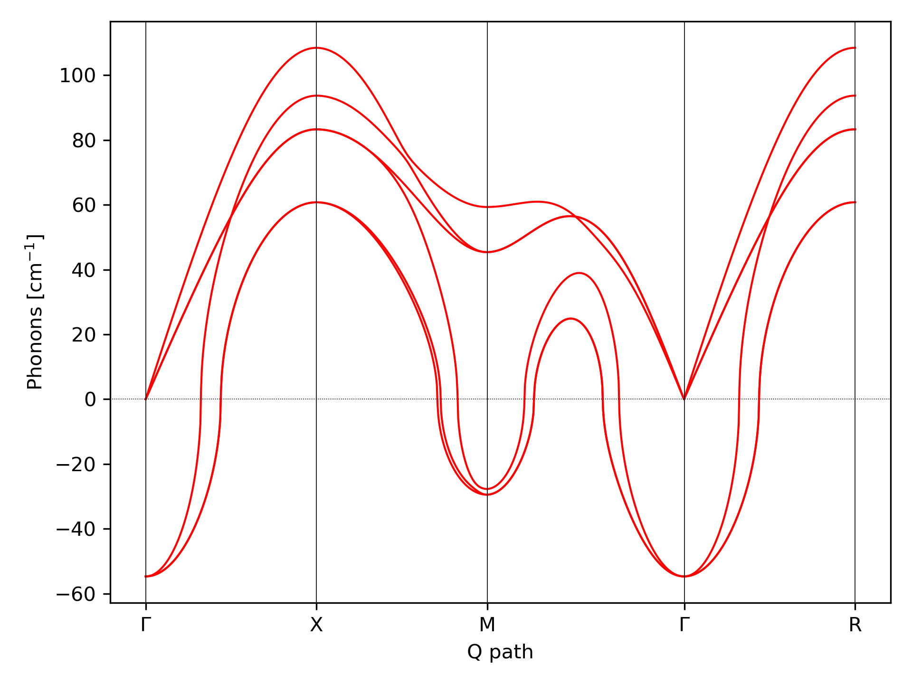
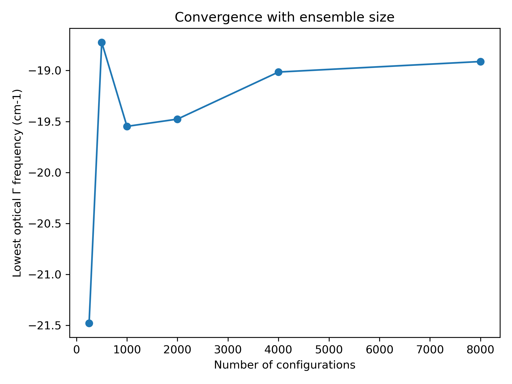
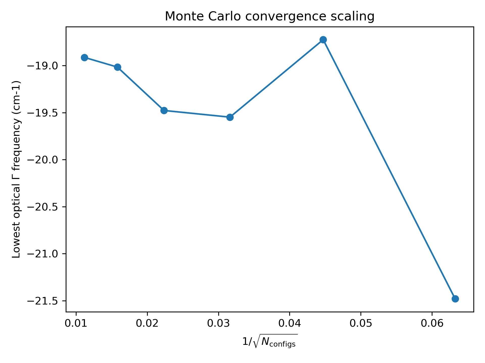
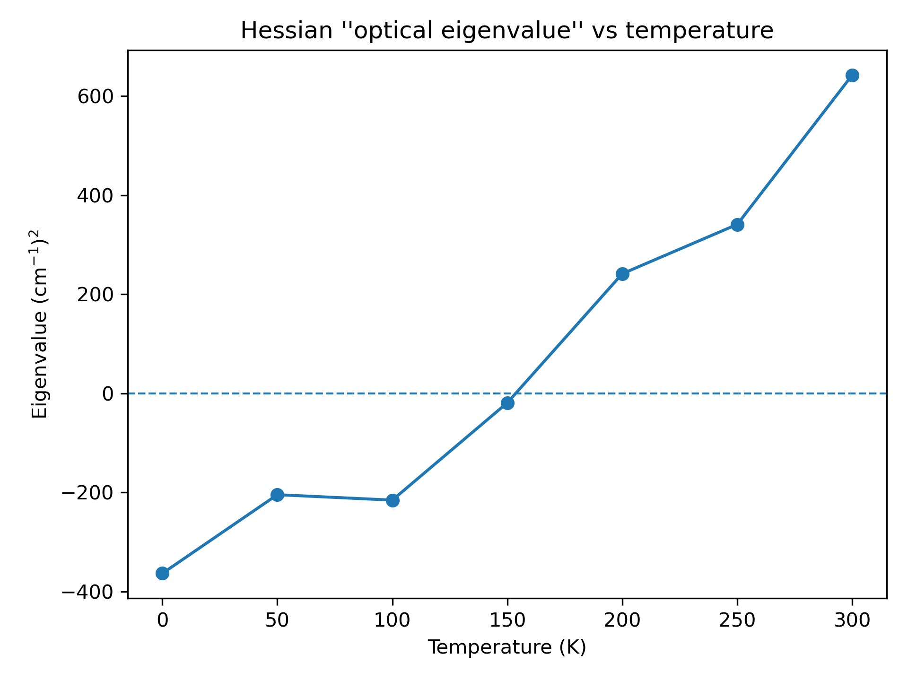

# Hands-on Session 3 - Calculations of Second-Order Phase Transitions with the SSCHA

In this hands-on session, we learn how to calculate second-order phase transitions within the SSCHA.

## Structural Instability: Calculation of the Hessian

According to Landau's theory, a second-order phase transition occurs when the free energy curvature around the high-symmetry structure in the direction of the order parameter becomes negative:


For structural *displacive* phase transitions, the order parameter is associated with phonon atomic displacements:

$$
\frac{\partial^2 F}{\partial R_a \partial R_b}
$$

where $F(R)$ is the free energy Hessian as a function of the average atomic positions (centroids). is the central quantity for studying second-order phase transitions. The SSCHA provides an analytical equation for the free energy Hessian, derived by Raffaello Bianco in the work [Bianco et al., Phys. Rev. B 96, 014111](https://journals.aps.org/prb/abstract/10.1103/PhysRevB.96.014111). The free energy curvature can be written as:

$$
\frac{\partial^2 F}{\partial {R_a}\partial {R_b}} = \Phi_{ab} + \sum_{cdef} \stackrel{(3)}{\Phi}_{acd}[1 - \Lambda\stackrel{(4)}{\Phi}]^{-1}_{cdef} \stackrel{(3)}{\Phi}_{efb}
$$

This quantity can be evulated within SSCHA adopting a sthocastic approach with the function call:

```python
ensemble.get_free_energy_hessian()
```

In order to provide a practical example while keeping the computational workload low, we employ a toy force field capable of reproducing the essential physics of ferroelectric transitions in FCC lattices. In particular, we focus on the SnTe crystal. SnTe crystallizes at room temperature and ambient pressure in the NaCl structure (space group Fm$\bar{3}$m), known as the $\beta$-SnTe phase, where two interpenetrating fcc sublattices of Sn and Te are present. At low temperature, around 100 K, it undergoes a phase transition and stabilizes in a rhombohedral structure (space group R3m), known as the $\alpha$-SnTe phase. The phase transition can be described as a two-step symmetry reduction: a polar displacement between the two fcc sublattices along the cubic [111] direction, which removes the inversion center, followed by a rhombohedral strain of the unit cell along the same diagonal. In the present work, we concentrate only on the first distortion. We define the interatomic potential $V(u)$ of the toy model as a function of the atomic displacements $u_a = R_a - R_a^{\mathrm{eq}}$ from the equilibrium positions $R_a^{\mathrm{eq}}$ of the rock-salt structure, retaining, beyond the quadratic contribution, only the anharmonic third- and fourth-order terms:
$$
V(u) =
\frac{1}{2}\sum_{ab}\phi_{ab} u^a u^b
+
\frac{1}{3!}\sum_{abc}\phi^{(3)}_{abc} u^a u^b u^c
+
\frac{1}{4!}\sum_{abcd}\phi^{(4)}_{abcd} u^a u^b u^c u^d .
$$
For the harmonic contribution $\phi_{ab}$, we employ the dynamical matrices computed from first principles on a $2 \times 2 \times 2$ q-point grid. The third- and fourth-order force constants are instead parametrized within the toy model. In particular, the third-order term $\phi^{(3)}{abc}$ is proportional to a single parameter $p_3$, while the fourth-order term $\phi^{(4)}{abcd}$ depends linearly on two parameters, $p_4$ and $p_{4\chi}$. We will use $p_4 = -0.022 ,\mathrm{eV/\AA^4}$, $p_{4\chi} = -0.014 ,\mathrm{eV/\AA^4}$, and $p_3 =  0.036475 ,\mathrm{eV/\AA^3}$.

The harmonic phono dispersion along an high-symmetry path of the Rbillouin zone (BZ) can be obatined with this script:
```python
import cellconstructor.Phonons
import cellconstructor.ForceTensor
import cellconstructor.Methods

import matplotlib.pyplot as plt

NQIRR = 3
PATH = "GXMGR"
N_POINTS = 1000

SPECIAL_POINTS = {
    "G": [0.0, 0.0, 0.0],
    "X": [0.5, 0.0, 0.0],
    "M": [0.5, 0.5, 0.0],
    "R": [0.5, 0.5, 0.5],
}

# Load HARM phonons
harm_dyn = cellconstructor.Phonons.Phonons("ffield_dynq_", NQIRR)


# Get band path
qpath, data = cellconstructor.Methods.get_bandpath(
    harm_dyn.structure.unit_cell,
    PATH,
    SPECIAL_POINTS,
    N_POINTS)

xaxis, xticks, xlabels = data

# Fourier interpolation along q-path
harm_dispersion = cellconstructor.ForceTensor.get_phonons_in_qpath(
    harm_dyn,
    qpath)

nmodes = harm_dyn.structure.N_atoms * 3

plt.figure(dpi=150)
ax = plt.gca()

for i in range(nmodes):
    ax.plot(
        xaxis,
        harm_dispersion[:, i],
        color="r",
        lw=1)

for x in xticks:
    ax.axvline(x, 0, 1, color="k", lw=0.4)

ax.axhline(0, 0, 1, color="k", ls=":", lw=0.4)

ax.set_xticks(xticks)
ax.set_xticklabels(xlabels)

ax.set_xlabel("Q path")
ax.set_ylabel("Phonons [cm$^{-1}$]")

plt.tight_layout()
plt.savefig("harm_dispersion.png", dpi=300)
plt.show()
```

<figure align="center">
  
  <figcaption>Harmonic phonon dispersion of SnTe.</figcaption>
</figure>

The dynamical instability observed at the harmonic level signals that the system may undergo a spontaneous phase transition as the temperature decreases.

As a first step, let us compute the SSCHA dynamical matrix for SnTe at different temperatures.
At $T = 0\,\mathrm{K}$, we proceed with this script:


```python
import os
import numpy as np
import warnings

# CellConstructor modules
import cellconstructor as CC
import cellconstructor.Phonons

# SSCHA modules
import sscha
import sscha.Ensemble
import sscha.SchaMinimizer
import sscha.Relax

# Toy-model force field
import fforces as ff
import fforces.Calculator


# ============================================================
# Ignore NumPy ComplexWarning generated during SSCHA updates
# ============================================================

try:
    ComplexWarning = np.exceptions.ComplexWarning
except AttributeError:
    ComplexWarning = np.ComplexWarning

warnings.filterwarnings("ignore", category=ComplexWarning)


# ============================================================
# INPUT PARAMETERS
# ============================================================

# Temperature in Kelvin
TEMPERATURE = 0

# Number of irreducible q-points
NQIRR = 3

# Number of configurations used in the SSCHA ensemble
N_CONFIGS = 256

# Prefix of the starting dynamical matrices
START_DYN = "/home/raffaello/SSCHA2026/HARM/ffield_dynq_"

# Dynamical matrices used to define the harmonic reference of the toy model
MODEL_DYN = "/home/raffaello/SSCHA2026/HARM/ffield_dynq_"


# ============================================================
# DEFINE THE TOY FORCE FIELD
# ============================================================

# Load the harmonic dynamical matrices
ff_dyn = CC.Phonons.Phonons(MODEL_DYN, NQIRR)

# Create the toy-model calculator
ff_calculator = ff.Calculator.ToyModelCalculator(ff_dyn)

# Select the type of anharmonic toy potential
ff_calculator.type_cal = "pbtex"

# Anharmonic parameters
ff_calculator.p3 = 0.036475
ff_calculator.p4 = -0.022
ff_calculator.p4x = -0.014


# ============================================================
# CREATE OUTPUT DIRECTORY
# ============================================================

output_dir = f"T_{TEMPERATURE}"
os.makedirs(output_dir, exist_ok=True)

# ============================================================
# LOAD STARTING DYNAMICAL MATRICES
# ============================================================

start_dyn = CC.Phonons.Phonons(START_DYN, NQIRR)

# If the starting dynamical matrices are not positive definite
# (i.e. imaginary phonon frequencies are present),
# enforce positive definiteness and 
# reimpose crystal symmetries and acoustic sum rule.

w, pols = start_dyn.DiagonalizeSupercell()

w_sorted = np.sort(w)
tol = -1e-4

if np.min(w_sorted[3:]) < tol:
    print("Non-acoustic imaginary phonon modes detected")
    start_dyn.ForcePositiveDefinite()
    start_dyn.Symmetrize()


# ============================================================
# CREATE SSCHA ENSEMBLE
# ============================================================

ensemble = sscha.Ensemble.Ensemble(
    start_dyn,
    TEMPERATURE
)


# ============================================================
# SETUP THE SSCHA MINIMIZER
# ============================================================

minimizer = sscha.SchaMinimizer.SSCHA_Minimizer(ensemble)

# Control minimization stability and convergence
minimizer.meaningful_factor = 0.01
minimizer.set_minimization_step(0.001)


# ============================================================
# SETUP SSCHA RELAXATION
# ============================================================

relax = sscha.Relax.SSCHA(
    minimizer,
    ase_calculator=ff_calculator,
    N_configs=N_CONFIGS
)


# ============================================================
# RUN THE SSCHA MINIMIZATION
# ============================================================

relax.relax()


# ============================================================
# SAVE FINAL SSCHA DYNAMICAL MATRICES
# ============================================================

relax.minim.dyn.save_qe(
    os.path.join(output_dir, "sscha_dyn_")
)

```


Plotting the phonon dispersion of the SSCHA dynamical matrices together with the harmonic phonon dispersion, we obtain the following result.

<figure align="center">
  
  <figcaption>Harmonic vs SSCHA phonon dispersion at T=0 K.</figcaption>
</figure>


```python
import os
import numpy as np
import warnings

import cellconstructor as CC
import cellconstructor.Phonons

import sscha.Ensemble
import sscha.SchaMinimizer
import sscha.Relax

import fforces as ff
import fforces.Calculator


# ============================================================
# Ignore NumPy ComplexWarning generated during SSCHA updates
# ============================================================

try:
    ComplexWarning = np.exceptions.ComplexWarning
except AttributeError:
    ComplexWarning = np.ComplexWarning

warnings.filterwarnings("ignore", category=ComplexWarning)


# ============================================================
# INPUT PARAMETERS
# ============================================================

TEMPERATURE = 0
NQIRR = 3

N_CONFIGS = 2000

# Already relaxed SSCHA dynamical matrices
SSCHA_DYN = f"/home/raffaello/SSCHA2026/RELAX/T_{TEMPERATURE}/sscha_dyn_"

# Dynamical matrices defining the harmonic part of the toy model
MODEL_DYN = "/home/raffaello/SSCHA2026/HARM/ffield_dynq_"


# ============================================================
# DEFINE THE TOY FORCE FIELD
# ============================================================

# Load the harmonic dynamical matrices
ff_dyn = CC.Phonons.Phonons(MODEL_DYN, NQIRR)

# Create the toy-model calculator
ff_calculator = ff.Calculator.ToyModelCalculator(ff_dyn)

# Select the type of anharmonic toy potential
ff_calculator.type_cal = "pbtex"

# Anharmonic parameters
ff_calculator.p3 = 0.036475
ff_calculator.p4 = -0.022
ff_calculator.p4x = -0.014


# ============================================================
# LOAD RELAXED SSCHA DYNAMICAL MATRICES
# ============================================================

sscha_dyn = CC.Phonons.Phonons(SSCHA_DYN, NQIRR)
sscha_dyn.Symmetrize()

# ============================================================
# CREATE SSCHA ENSEMBLE
# ============================================================

ensemble = sscha.Ensemble.Ensemble(
    sscha_dyn,
    TEMPERATURE
)


# ============================================================
# SETUP THE SSCHA MINIMIZER
# ============================================================

minimizer = sscha.SchaMinimizer.SSCHA_Minimizer(ensemble)

# Control minimization stability and convergence
minimizer.meaningful_factor = 0.01
minimizer.set_minimization_step(0.001)


# ============================================================
# SETUP SSCHA RELAXATION
# ============================================================

relax = sscha.Relax.SSCHA(
    minimizer,
    ase_calculator=ff_calculator,
    N_configs=N_CONFIGS
)


# ============================================================
# RUN THE SSCHA MINIMIZATION
# ============================================================

relax.relax()

# ============================================================
# SAVE FINAL SSCHA DYNAMICAL MATRICES
# ============================================================

relax.minim.dyn.save_qe("refined_sscha_dyn_")


# Reweight the ensemble using the refined dynamical matrix
ensemble.update_weights(minimizer.dyn, TEMPERATURE)

# Compute the free-energy Hessian
dyn_hessian = ensemble.get_free_energy_hessian(
    include_v4=False,
    get_full_hessian=True,
    return_d3=False,
)

# Save the Hessian dynamical matrix
dyn_hessian.save_qe("hessian_dyn_")


print("\nDone.")
```


<div style="display: flex; justify-content: center; gap: 20px;">

  <figure style="text-align: center;">
    
    <figcaption>Frequency vs number of configurations. </figcaption>
  </figure>

  <figure style="text-align: center;">
    
    <figcaption>Frequency vs inverse square root of the number of configurations.</figcaption>
  </figure>

</div>


<div style="display: flex; justify-content: center; gap: 20px;">

  <figure style="text-align: center;">
    
    <figcaption> </figcaption>
  </figure>

  <figure style="text-align: center;">
    
    <figcaption></figcaption>
  </figure>

</div>


1. Load the metrices and generate the ensemble

new_ensemble = sscha.Ensemble.Ensemble(dyn, T)
new_ensemble.generate(N)
new_ensemble.compute_ensemble(calculator)

# Compute the free energy hessian on the final dynamical matrix after
minimization with the importance sampling
hessian = new_minim.ensemble.get_free_energy_hessian(include_v4 = False)

# Save it in QE dynamical matrix format
hessian.save_qe("hessian_v3_")


1. First, we prepare the Toy model force field that substitutes the usual ab initio calculations for this tutorial. This force field needs the harmonic dynamical matrix to be initialized, along with the higher-order parameters. Finally, the dynamical matrix for the minimization is loaded and ready. Since we are studying a system that has a spontaneous symmetry breaking at low temperature, the harmonic dynamical matrices will have imaginary phonons. We must enforce phonons to be positive definite to start an SSCHA minimization.

```python
    # Load the dynamical matrix for the force field
    ff_dyn = CC.Phonons.Phonons("ffield_dynq", 3)

    # Setup the forcefield with the correct parameters
    ff_calculator = ff.Calculator.ToyModelCalculator(ff_dyn)
    ff_calculator.type_cal = "pbtex"
    ff_calculator.p3 = 0.036475
    ff_calculator.p4 = -0.022
    ff_calculator.p4x = -0.014

    # Initialization of the SSCHA matrix
    dyn_sscha = CC.Phonons.Phonons(Files_dyn_SnTe, nqirr)
    # Flip the imaginary frequencies into real ones
    dyn_sscha.ForcePositiveDefinite()
    # Apply the ASR and the symmetry group
    dyn_sscha.Symmetrize()
```

2. The next step is to create the ensemble for the specified temperature. As an extra, we also look for the space group of the structure.

```python
    ensemble = sscha.Ensemble.Ensemble(dyn_sscha,
            T0 = Temperature, supercell = dyn_sscha.GetSupercell())
    # Detect space group
    symm=spglib.get_spacegroup(dyn_sscha.structure.get_ase_atoms(),
            0.005)
    print('Initial SG = ', symm)
```

3. Next comes the minimization step. Here we can set the fourth root minimization, in which, instead of optimizing the auxiliary dynamical matrices themselves, we optimize their fourth root.

$$
\Phi = \left({\sqrt[4]{\Phi}}\right)^4
$$

This constrains the dynamical matrix to be positive definite during the minimization. Next, the automatic relaxation is set with the option to use the Sobol sequence for the ensemble generation.

We also set a custom function to save the frequencies at each iteration, to see how they evolve. This is very useful for understanding whether the algorithm has converged.

Then, the dynamical matrix of the converged minimization is saved to a file, and finally we take a look at the space group and the structure.

```python
    minim = sscha.SchaMinimizer.SSCHA_Minimizer(ensemble)

    # Now we setup the minimization parameters
    # Since we are quite far from the correct solution,
    # we will use a small optimization step
    minim.set_minimization_step(0.25)

    # Reduce the threshold for the gradient convergence
    minim.meaningful_factor = 0.01

    # If the minimization ends with few steps (less than 10),
    # decrease it, if it takes too much, increase it

    # We decrease the Kong-Liu effective sample size below
    # which the population is stopped
    minim.kong_liu_ratio = 0.5 # Default 0.5
    # We relax the structure
    relax = sscha.Relax.SSCHA(minim,
                      ase_calculator = ff_calculator,
                      N_configs = configurations,
                      max_pop = 50)

    # Setup the custom function to print the frequencies
    # at each step of the minimization
    io_func = sscha.Utilities.IOInfo()
    io_func.SetupSaving(File_frequencies)
    # The file that will contain the frequencies is frequencies.dat

    # Now tell relax to call the function to save the frequencies
    # after each iteration
    # CFP stands for Custom Function Post (Post = after the minimization step)
    #relax.setup_custom_functions(custom_function_post = io_func.CFP_SaveFrequencies)
    relax.setup_custom_functions(custom_function_post = io_func.CFP_SaveAll)
    # Finally we do all the free energy calculations.
    relax.relax()
    #relax.vc_relax(static_bulk_modulus=40, fix_volume = False)

    # Save the final dynamical matrix
    relax.minim.dyn.save_qe(File_final_dyn)
    # Detect space group
    symm=spglib.get_spacegroup(relax.minim.dyn.structure.get_ase_atoms(),
                0.005)
    print('New SG = ', symm)
    view(relax.minim.dyn.structure.get_ase_atoms())
```

This code will calculate the SSCHA minimization with the `ff_calculator`. We can use `sscha-plot-data.py` to take a look at the minimization.

```bash
python sscha-plot-data.py frequencies.dat
```


Note: this force field model is not able to compute stress, as it is defined only at fixed volume, so we cannot use it for a variable cell relaxation.

**Now we can search for instabilities.**

If we have a very small mode in the SSCHA frequencies, it means that associated with that mode we have huge fluctuations. This can indicate an instability. However, to test this we need to compute the free energy curvature along this mode. This can be obtained in one shot thanks to the theory developed in [Bianco et al., Phys. Rev. B 96, 014111](https://journals.aps.org/prb/abstract/10.1103/PhysRevB.96.014111).

For that, we create another program to do the job.

As before, we begin by importing some libraries and setting variables:

```python
#!/usr/bin/env python
# -*- coding: utf-8 -*-
#
#  SSCHA_exercise_Unstable.py
#
# Import the cellconstructor stuff
import cellconstructor as CC
import cellconstructor.Phonons
import cellconstructor.ForceTensor
import cellconstructor.Structure
import cellconstructor.Spectral

# Import the modules of the force field
import fforces as ff
import fforces.Calculator

# Import the modules to run the sscha
import sscha, sscha.Ensemble, sscha.SchaMinimizer
import sscha.Relax, sscha.Utilities

import spglib
from ase.visualize import view

# Import Matplotlib to plot
import numpy as np
import matplotlib.pyplot as plt
from matplotlib import cm
import timeit

#Setting the variables:
#Setting the temperature in Kelvin:
Temperature = 0
#Setting the number of configurations:
configurations = 50
#Setting the names and location of the files:
Files_dyn_SnTe = "ffield_dynq"
#Set the number of irreducible q (related to the supercell size):
nqirr = 3
#Setting the frequencies output file:
File_frequencies = "frequencies.dat"
#Setting the dynamical matrix output filename:
File_final_dyn = "final_sscha_T{}_".format(int(Temperature))
```

Now we look for that instability:

1. The `ff_calculator` toy potential is defined as we have seen in the previous program.

```python
    # Load the dynamical matrix for the force field
    ff_dyn = CC.Phonons.Phonons("ffield_dynq", 3)

    # Setup the forcefield with the correct parameters
    ff_calculator = ff.Calculator.ToyModelCalculator(ff_dyn)
    ff_calculator.type_cal = "pbtex"
    ff_calculator.p3 = 0.036475
    ff_calculator.p4 = -0.022
    ff_calculator.p4x = -0.014

    # Initialization of the SSCHA matrix
    dyn_sscha = CC.Phonons.Phonons(Files_dyn_SnTe, nqirr)
    dyn_sscha.ForcePositiveDefinite()

    # Apply also the ASR and the symmetry group
    dyn_sscha.Symmetrize()
```

2. Next, we load the dynamical matrix calculated previously with the `ff_calculator` toy potential, so there is no need to calculate it again.

```python
    # The SSCHA dynamical matrix is needed (the one after convergence)
    # We reload the final result (no need to rerun the sscha minimization)
    dyn_sscha_final = CC.Phonons.Phonons(File_final_dyn, nqirr)
```

3. Then, since the Hessian calculation is more sensitive, we generate a new ensemble with more configurations. To compute the Hessian we will use an ensemble of 10000 configurations. Note that we can use fewer if we use the Sobol sequence, or we can load a previously generated ensemble.

```python
    # We reset the ensemble
    ensemble = sscha.Ensemble.Ensemble(dyn_sscha_final, T0 = Temperature,
                        supercell = dyn_sscha_final.GetSupercell())

    # We need a bigger ensemble to properly compute the hessian
    # Here we will use 10000 configurations
    ensemble.generate(5000, sobol = True)
    #ensemble.generate(10000, sobol = False)
    #We could also load the ensemble with
    # ensemble.load("data_ensemble_final", N = 100, population = 5)
```

4. We now compute forces and energies using the force field calculator.

```python
    # We now compute forces and energies using the force field calculator
    ensemble.get_energy_forces(ff_calculator, compute_stress = False)
```

5. Finally, the free energy Hessian is calculated with the `get_free_energy_hessian` function. We can choose whether to neglect or include the four-phonon scattering process. Four-phonon scattering processes require a huge memory allocation for big systems, scaling as $(3N)^4$ with N the number of atoms in the supercell. Moreover, they may also require more configurations to converge.

In almost all the systems we have studied up to now, we found this four-phonon scattering at high order to be negligible. We remark that the SSCHA minimization already includes four-phonon scattering at the lowest order perturbation theory; thus, neglecting this term only affects combinations of one or more four-phonon scattering with two three-phonon scatterings (high-order diagrams). For more details, see [Bianco et al., Phys. Rev. B 96, 014111](https://journals.aps.org/prb/abstract/10.1103/PhysRevB.96.014111).

We can then print the frequencies of the Hessian. If an imaginary frequency is present, then the system wants to spontaneously break the high-symmetry phase.

```python
    print("Updating the importance sampling...")
    # If the sscha matrix was not the one used to compute the ensemble
    # We must update the ensemble weights
    # We can also use this function to simulate a different temperature.
    ensemble.update_weights(dyn_sscha_final, Temperature)
    # ----------- COMPUTE THE FREE ENERGY HESSIAN -----------
    print("Computing the free energy hessian...")
    dyn_hessian = ensemble.get_free_energy_hessian(include_v4 = False)
    # We neglect high-order four phonon scattering
    #dyn_hessian = ensemble.get_free_energy_hessian(include_v4 = True,
    #              get_full_hessian = True,verbose = True) # Full calculus
    # We can save the free energy hessian as a dynamical matrix
    # in quantum espresso format
    dyn_hessian.save_qe("hessian")
    # -------------------------------------------------------
    # We calculate the frequencies of the hessian:
    w_hessian, pols_hessian = dyn_hessian.DiagonalizeSupercell()

    # Print all the frequency converting them into cm-1 (They are in Ry)
    print("\n".join(["{:16.4f} cm-1".format(w * CC.Units.RY_TO_CM) for w in w_hessian]))
```

The frequencies in the free energy Hessian are temperature dependent.

We can look at the eigenmodes of the free energy Hessian to check if we have imaginary phonons. If there are negative frequencies, then we have found an instability. You can check what happens if you include the fourth order.

> **Exercise:**
>
> The Sobol sequences reduce the number of configurations by providing a better mapping of the Gaussian than a random distribution. By uniformly spreading the samples with a low-discrepancy sequence like Sobol, it is possible to reduce the number of configurations needed. Low-discrepancy sequences tend to sample space "more uniformly" than random numbers. Algorithms that use such sequences may have superior convergence. You can test this in the calculation of the Hessian by changing the number of configurations and the mapping scheme in the `ensemble.generate()` function.

## Second Order Phase Transition

Up to now, we studied the system at T = 0 K and found that there is an instability. However, we can repeat the minimization at many temperatures and track the phonon frequency to see at which temperature the system becomes stable.

Again, we load and set the variables. Now we have several temperatures, so we store them in an array:

```python
#!/usr/bin/env python
# -*- coding: utf-8 -*-
#
#  SSCHA_exercise_Unstable.py
#
# Import the cellconstructor stuff
import cellconstructor as CC
import cellconstructor.Phonons
import cellconstructor.ForceTensor
import cellconstructor.Structure
import cellconstructor.Spectral

# Import the modules of the force field
import fforces as ff
import fforces.Calculator

# Import the modules to run the sscha
import sscha, sscha.Ensemble, sscha.SchaMinimizer
import sscha.Relax, sscha.Utilities

import spglib
from ase.visualize import view

# Import Matplotlib to plot
import numpy as np
import matplotlib.pyplot as plt
from matplotlib import cm
import timeit

#Setting the variables:
#Setting the temperature in Kelvin:
Temperature = 0
#Setting the number of configurations:
configurations = 50
#Setting the names and location of the files:
Files_dyn_SnTe = "ffield_dynq"
#Set the number of irreducible q (related to the supercell size):
nqirr = 3
#Setting the frequencies output file:
File_frequencies = "frequencies.dat"
#Setting the dynamical matrix output filename:
File_final_dyn = "final_sscha_T{}_".format(int(Temperature))
sobol = False
sobol_scatter = False
```

1. Like in the previous program, first we prepare the Toy model force field:

```python
    # Load the dynamical matrix for the force field
    ff_dyn = CC.Phonons.Phonons("ffield_dynq", 3)

    # Setup the forcefield with the correct parameters
    ff_calculator = ff.Calculator.ToyModelCalculator(ff_dyn)
    ff_calculator.type_cal = "pbtex"
    ff_calculator.p3 = 0.036475
    ff_calculator.p4 = -0.022
    ff_calculator.p4x = -0.014
```

2. We are going to need a range of temperatures for this calculation:

```python
    # Define the temperatures, from 50 to 300 K, 6 temperatures
    temperatures = np.linspace(50, 300, 6)

    lowest_hessian_mode = []
    lowest_sscha_mode = []

    # Perform a simulation at each temperature
    t_old = Temperature
```

3. In the next part, we condense the calculation of the Hessians in a loop over different temperatures. At the end, it searches for the lowest non-acoustic frequency and saves it together with the corresponding auxiliary SSCHA frequency.

```python
    for Temperature in temperatures:
        # Load the starting dynamical matrix
        dyn = CC.Phonons.Phonons(File_final_dyn.format(int(t_old)), nqirr)

        # Prepare the ensemble
        ensemble = sscha.Ensemble.Ensemble(dyn, T0 = Temperature,
                                      supercell = dyn.GetSupercell())

        # Prepare the minimizer
        minim = sscha.SchaMinimizer.SSCHA_Minimizer(ensemble)
        minim.min_step_struc = 0.05
        minim.min_step_dyn = 0.002
        minim.kong_liu_ratio = 0.5
        minim.meaningful_factor = 0.000001
        #minim.root_representation = "root4"
        #minim.precond_dyn = False
        #minim.minim_struct = True
        #minim.neglect_symmetries = True
        minim.enforce_sum_rule = True  # Lorenzo's solution to the error

        # Prepare the relaxer (through many population)
        relax = sscha.Relax.SSCHA(minim, ase_calculator = ff_calculator,
                      N_configs=configurations, max_pop=20)

        # Relax
        relax.relax(sobol = sobol, sobol_scramble = sobol_scatter)
        #relax.relax()

        # Save the dynamical matrix
        relax.minim.dyn.save_qe(File_final_dyn.format(int(Temperature)))

        # Detect space group
        symm=spglib.get_spacegroup(relax.minim.dyn.structure.get_ase_atoms(),
                                        0.005)
        print('Current SG = ', symm,' at T=',int(Temperature))

        # Recompute the ensemble for the hessian calculation
        ensemble = sscha.Ensemble.Ensemble(relax.minim.dyn, T0 = Temperature,
                                supercell = dyn.GetSupercell())
        ensemble.generate(configurations, sobol = sobol,
                          sobol_scramble = sobol_scatter)
        ensemble.get_energy_forces(ff_calculator, compute_stress = False)
        #gets the energies and forces from ff_calculator

        #update weights!!!
        ensemble.update_weights(relax.minim.dyn, Temperature)
        # Get the free energy hessian
        dyn_hessian = ensemble.get_free_energy_hessian(include_v4 = False)
        #free energy hessian as in Bianco paper 2017
        dyn_hessian.save_qe("hessian_T{}_".format(int(Temperature)))

        # Get the lowest frequencies for the sscha and the free energy hessian
        w_sscha, pols_sscha = relax.minim.dyn.DiagonalizeSupercell() #dynamical matrix
        # Get the structure in the supercell
        superstructure = relax.minim.dyn.structure.generate_supercell(relax.minim.dyn.GetSupercell())

        # Discard the acoustic modes
        acoustic_modes = CC.Methods.get_translations(pols_sscha,
                                      superstructure.get_masses_array())
        w_sscha = w_sscha[~acoustic_modes]

        lowest_sscha_mode.append(np.min(w_sscha) * CC.Units.RY_TO_CM) # Convert from Ry to cm-1

        w_hessian, pols_hessian = dyn_hessian.DiagonalizeSupercell() #recomputed dyn for hessian
        # Discard the acoustic modes
        acoustic_modes = CC.Methods.get_translations(pols_hessian,
                                        superstructure.get_masses_array())
        w_hessian = w_hessian[~acoustic_modes]
        lowest_hessian_mode.append(np.min(w_hessian) * CC.Units.RY_TO_CM) # Convert from Ry to cm-1
        #print ("\n".join(["{:.4f} cm-1".format(w * CC.Units.RY_TO_CM) for w in pols_hessian]))
        #exit()

        t_old = Temperature
    # We prepare now the file to save the results
    freq_data = np.zeros( (len(temperatures), 3))
    freq_data[:, 0] = temperatures
    freq_data[:, 1] = lowest_sscha_mode
    freq_data[:, 2] = lowest_hessian_mode

    # Save results on file
    np.savetxt("{}_hessian_vs_temperature.dat".format(configurations),
                freq_data, header = "T [K]; SSCHA mode [cm-1]; Free energy hessian [cm-1]")
```

4. Finally, we produce a graphical output of the data.

```python
    hessian_data = np.loadtxt("{}_hessian_vs_temperature.dat".format(configurations))

    plt.figure(dpi = 120)
    plt.plot(hessian_data[:,0], hessian_data[:,1],
                              label = "Min SCHA freq", marker = ">")
    plt.plot(hessian_data[:,0], hessian_data[:,2],
                              label = "Free energy curvature", marker = "o")
    plt.axhline(0, 0, 1, color = "k", ls = "dotted") # Draw the zero
    plt.xlabel("Temperature [K]")
    plt.ylabel("Frequency [cm-1]")
    plt.legend()
    plt.tight_layout()
    plt.savefig('{}_Temp_Freq.png'.format(configurations))
    #plt.show()

    plt.figure(dpi = 120)
    plt.plot(hessian_data[:,0], np.sign(hessian_data[:,2]) * hessian_data[:,2]**2,
                        label = "Free energy curvature", marker = "o")
    plt.axhline(0, 0, 1, color = "k", ls = "dotted") # Draw the zero
    plt.xlabel("Temperature [K]")
    plt.ylabel("$\omega^2$ [cm-2]")
    plt.legend()
    plt.tight_layout()
    plt.savefig('{}_Temp_Omeg.png'.format(configurations))
    #plt.show()
```

We will simulate temperatures up to room temperature (300 K) with steps of 50 K. Note that this will perform all the steps above 6 times, so it may take some minutes depending on the PC (on an i3 from 2015, with one core, it took 2 hours). If it takes too long, you can reduce the number of steps by changing the temperature array in `Temperature_i = np.linspace(50, 300, 6)`.


In the figure above, we can see that the phase transition is between 100 K and 150 K. The data points do not form a linear figure. We can increase the number of temperature points to locate the exact transition temperature, but there is another better way to find it.


For the Landau theory of phase transitions, since the SSCHA is a mean-field approach, we expect that around the transition the critical exponent of the temperature goes as:

$$
\omega \sim \sqrt{\Phi}
$$

For this reason, it is better to plot the temperature versus the square of the frequency, as in the figure above. This makes the graph linear, so we can easily estimate the critical temperature by linear interpolation.

We are using only 50 configurations in the ensemble. Note that this makes the calculation fast, but it is a low number for these calculations because the free energy calculations are noisier than the SSCHA frequencies. This is because the computation of the free energy requires the third-order force constant tensor, which requires more configurations to converge.

> **Exercise:**
>
> How does the calculation of the free energy change with the number of configurations?


> **Exercise:**
>
> Plot the Hessian phonon dispersion.
>
> 


