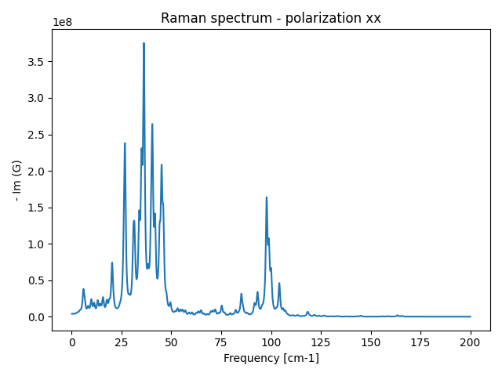
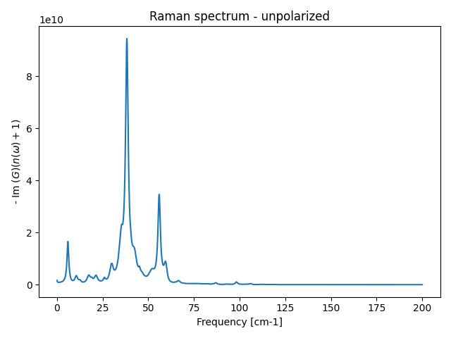

# Hands-on Session 3 - Spectral functions, Raman and infrared spectra with the Time-Dependent SSCHA


## Theoretical background

This tutorial focuses on the computation of dynamical properties of materials.
The key quantity which is measured by experiments is the *dynamical response function* $\chi(\omega)$.
The response function probes how the material responds to a time-dependent external perturbation.
We can model any experiment as follows: the material is in equilibrium for $t < t_0$, then a perturbation is turned on at $t_0$, and we measure a property $A$ at a later time $t$. The measured response is the convolution of the perturbation over all intervening times, weighted by the response function $\chi(t-t')$, which describes how perturbations propagate in time:
$$
A(t) = A_0 + \int_{t_0}^t dt' \chi(t - t') F(t')
$$
where $F(t')$ is the external time-dependent perturbation, and $A_0$ is the value of the property $A$ in equilibrium.
Alternatively, in Fourier space, the convolution becomes a simple product:
$$
A(\omega) = A_0 + \chi(\omega) F(\omega)
$$

This is very general, and it applies to any experiment. In this tutorial, we focus on IR and Raman spectroscopy.
For the case of IR, the perturbation is the electric field of the light, which interacts with the material by generating an oscillating dipole. The response of the material is the *emitted* (or absorbed) electric field, which is related to how the dipole moment of the material oscillates in time.
So the observable $A(t)$ is the dipole moment of the material, and the perturbation $F(t)$ is the amplitude of the electric field of the light.

The Kubo equation for the response function is
$$
\chi(t) = \frac{i}{\hbar}\theta(t)\left\langle M(t)M(0)\right\rangle
$$
where $\hat M(t)$ is the dipole moment operator in the Heisenberg picture, and $\left\langle\cdot\right\rangle$ is the quantum average at finite temperature.
The Time-Dependent SSCHA (TD-SCHA) extends the SSCHA framework to compute dynamical response functions. Here we will use the Lanczos algorithm to compute the response function in Fourier space, which is more efficient than computing it in time and then Fourier transforming it.

The first step is to convert the dipole operator in phonons creation and annihilation operators. To this aim, we can approximate the dipole moment as a linear function of the atomic displacements $\hat u$:
$$
\hat M(t) = \left.\frac{\partial M}{\partial u}\right|_{u = 0} \hat u(t) + O(u^2)
$$
The derivative of the dipole moment with respect to the atomic displacements is precisely the Born effective charge:
$$
Z^i_{\alpha\beta} = \frac{\partial M_\alpha}{\partial u^i_\beta} = \frac{\partial^2 \mathcal E}{\partial u^i_\beta \partial E_\alpha}
$$
where $E_\alpha$ is the electric field in the $\alpha$ Cartesian direction, $u^i_\beta$ is the displacement of atom $i$ in the $\beta$ Cartesian direction, and $\mathcal E$ is the total energy of the system (Born-Oppenheimer).
Using this in the expression of the susceptibility, we obtain:
$$
\chi_{\text{IR}\alpha}(t) = \sum_{ij}\sum_{\beta\gamma} \frac{Z^i_{\alpha\beta} Z^j_{\alpha\gamma}}{\sqrt{m_i m_j}}\sqrt{m_im_j} \left\langle\hat u^i_\beta(t) \hat u^j_\gamma(0)\right\rangle
$$
The last term is the so-called phonon Green's function, which represents the propagation of a phonon created at time $t=0$ and destroyed at time $t$.
$$
G^{ij}_{\alpha\beta}(t) = \sqrt{m_i m_j}\left\langle\hat u_\alpha^i(t) \hat u^j_\beta(0)\right\rangle
$$

Analogously, the Raman spectrum is related to the response of the material to two electric fields, which interact with the material by generating an oscillating polarizability. The observable $A(t)$ is the polarizability of the material, and the perturbation $F(t)$ is the amplitude of the two overlapping electric fields which interfere within the material. The Raman susceptibility can be written as:
$$
\chi_\text{Raman}(t) = \left\langle\hat\alpha_{\alpha\beta}(t) \hat\alpha_{\alpha\beta}(0)\right\rangle
$$
where $\hat \alpha_{\alpha\beta}$ is the polarizability operator, which can be approximated as a linear function of the atomic displacements:
$$
\hat \alpha_{\alpha\beta}(t) = \left.\frac{\partial \alpha_{\alpha\beta}}{\partial u^i_\gamma}\right|_{u = 0} \hat u^i_\gamma(t) + O(u^2)
$$
$$
\Xi^i_{\alpha\beta\gamma} = \frac{\partial \alpha_{\alpha\beta}}{\partial u^i_\gamma} = \frac{\partial^3 \mathcal E}{\partial u^i_\gamma \partial E_\alpha \partial E_\beta}
$$
where $\Xi^i_{\alpha\beta\gamma}$ is the Raman tensor, which is the third derivative of the total energy (Born-Oppenheimer) with respect to the atomic displacements and the two electric fields (incoming-outgoing).

Notably, the Raman requires two electric fields because it is a scattering, where incoming and outcoming radiation are different. The IR instead is an absorption/emission, where incoming and outcoming radiation are the same.

The Raman susceptibility is then:
$$
\chi_\text{Raman}(t) =  \left\langle\hat\alpha_{\alpha\beta}(t) \hat\alpha_{\alpha\beta}(0)\right\rangle = \sum_{ij}\sum_{\gamma\delta} \frac{\Xi^i_{\alpha\beta\gamma} \Xi^j_{\alpha\beta\delta}}{\sqrt{m_i m_j}}\sqrt{m_im_j} \left\langle\hat u^i_\gamma(t) \hat u^j_\delta(0)\right\rangle
$$

Also here, the last term is the phonon Green's function, which represents the propagation of a phonon created at time $t=0$ and destroyed at time $t$.
Therefore, to compute the IR and Raman spectra, we need to compute the phonon Green's function.
Going in Fourier space, we get
$$
\chi_{\text{IR}\,\alpha}(\omega) = \sum_{ij}\sum_{\beta\gamma} \frac{Z^i_{\alpha\beta} Z^j_{\alpha\gamma}}{\sqrt{m_i m_j}}\sqrt{m_im_j} G^{ij}_{\beta\gamma}(\omega)
$$
$$
\chi_{\text{Raman}\,\alpha\beta}(\omega) = \sum_{ij}\sum_{\gamma\delta} \frac{\Xi^i_{\alpha\beta\gamma} \Xi^j_{\alpha\beta\delta}}{\sqrt{m_i m_j}}\sqrt{m_im_j} G^{ij}_{\gamma\delta}(\omega)
$$

### The phonon Green's function

The phonon Green's function can be computed within the TD-SCHA. In general, we can write the Green's function as a non-interacting Green's function plus a self-energy:
$$
G^{-1}(\omega) = G_0^{-1}(\omega) - \Pi(\omega)
$$
where $G_0(\omega)$ is a non-interacting Green's function for *harmonic*-like phonons, while $\Pi(\omega)$ is the phonon self-energy, which depends on the frequency.
In the TD-SCHA theory, the non-interacting Green's function is defined as the Green's function of the auxiliary SSCHA harmonic Hamiltonian.

$$
G_0^{-1}(\omega) = I\omega^2 - D_\text{SSCHA}
$$
where $I$ is the identity matrix and $D_\text{SSCHA}$ is the dynamical matrix of the SSCHA Hamiltonian.

The self-energy involves the third- and fourth-order interatomic force constants:
$$
\Pi_{ab}(\omega) = -\frac 12\sum_{cd\mu\nu} \overset{(3)}{\Phi}_{acd} \Lambda^{cd}_{\mu\nu}(\omega)\left[ 1 +\frac 12 \overset{(4)}{\Phi}\Lambda(\omega)\right]^{-1} \overset{(3)}{\Phi}_{\nu b}
$$
This corresponds to the same expression derived for the Free energy Hessian; see [Bianco et al., Physical Review B, 96, 014111, 2017](https://journals.aps.org/prb/abstract/10.1103/PhysRevB.96.014111).
where $\Lambda^{cd}_{\mu\nu}(\omega)$ is the Fourier transform of the two-phonon propagator, which can be computed from the equilibrium non interacting Green's function $G_0(\omega)$ as:
$$
\Lambda^{ijlm}_{\alpha\beta\gamma\delta}(t) = \sqrt{m_i m_j m_l m_m}\left\langle\hat u^i_\alpha(t) \hat u^j_\beta(t) \hat u^l_\gamma(0) \hat u^m_\delta(0)\right\rangle_0
$$

Computing the full inversion of the self-energy for every value of the frequency is computationally extremely expensive.
It is possible, with an efficient algorithm (Lanczos), to show that the Green's function can be obtained by inverting a special matrix, see [Monacelli, Mauri, Physical Review B 103, 104305, 2021](https://journals.aps.org/prb/abstract/10.1103/PhysRevB.103.104305).

In this tutorial, we will use this Lanczos algorithm to compute the phonon Green's function and, consequently, the IR spectrum of CsPbI3.

To run these calculations, we need the `tdscha` package (it is recommended to configure it with the Julia speedup to run faster; see the installation guide).

## Tutorial

We need to first relax a complete SSCHA calculation, exactly as for the free energy hessian.
This can be performed via the `sscha_relax.py` script, which performs an automatic (fixed volume) sscha relaxation from the Harmonic dynamical matrix
using 256 configurations.

We provide the final result already as `sscha_auxiliary_dyn_` files.
The first step for a dynamical linear response calculation is to have a very well converged auxiliary dynamical matrix.
For this purpose, it is useful to run an additional minimization with a higher number of configurations once the initial relaxation is done.

This is done by the script `last_sscha_minim.py` which we will analyze in the next section.

```python
import sys, os
import cellconstructor as CC, cellconstructor.Phonons
import sscha, sscha.Ensemble, sscha.SchaMinimizer

from quippy.potential import Potential


TEMPERATURE = 450 # K
NQIRR = 4
START_DYN = "sscha_auxiliary_dyn_"
POTENTIAL = "../../Materials/GAP_1.xml"
N_CONFIGS = 1024
POP_ID = 100


def last_sscha_relax(temperature = TEMPERATURE):
    # Load the sscha dynamical matrix
    dyn = CC.Phonons.Phonons(START_DYN, NQIRR)

    # Load the interatomic Potential for CsPbI3
    calc = Potential("IP GAP", param_filename=POTENTIAL)

    # Generate the last esemble
    ensemble = sscha.Ensemble.Ensemble(dyn, temperature)
    ensemble.generate(N_CONFIGS)

    # Compute the energies and forces of the ensemble with the GAP potential
    ensemble.compute_ensemble(calc)

    # Compute a full sscha minimization on the new bigger ensemble
    minim = sscha.SchaMinimizer.SSCHA_Minimizer(ensemble)
    minim.set_minimization_step(0.02)
    minim.meaningful_factor = 0.01
    minim.run()

    # Save the final dynamical matrix and ensemble for further calculations
    minim.ensemble.save_bin("data", POP_ID)
    minim.dyn.save_qe("sscha_converged_dyn_")


last_sscha_relax()
```

This script performs a full SSCHA minimization starting from the auxiliary dynamical matrix obtained from the previous SSCHA relaxation, but using a bigger ensemble of 1024 configurations.
The final ensemble is saved in binary format inside
the directory `data`, with a unique ID of `100` (any other ensemble with that ID will be overwritten). The final SSCHA auxiliary dynamical matrix is saved in the file `sscha_converged_dyn_`.
These are useful if you want to perform multiple linear response calculations, as they do not need to be recomputed.


Once we have the final converged auxiliary dynamical matrix, we can compute the phonon Green's function and the IR spectrum with the script `tdscha_run_ir.py`.

```python
import cellconstructor as CC, cellconstructor.Phonons
import sscha, sscha.Ensemble
import numpy as np

import tdscha, tdscha.DynamicalLanczos

import sys, os

TEMPERATURE = 450 # K
NQIRR = 4 # Irreducible q points of the dynamical matrix

# Info about the dynamical matrix and the ensemble
ORIGINAL_DYN = "sscha_auxiliary_dyn_"
FINAL_DYN = "sscha_converged_dyn_"
POP_ID = 100

def compute_ir():
    # Load the original ensemble
    dyn_original = CC.Phonons.Phonons(ORIGINAL_DYN, NQIRR)
    ensemble = sscha.Ensemble.Ensemble(dyn_original, TEMPERATURE)
    ensemble.load_bin("data", POP_ID)

    # Lets load the final converged dynamical matrix
    final_dyn = CC.Phonons.Phonons(FINAL_DYN, NQIRR)
    
    # To prepare the IR or Raman, we need 
    # IR : dielectric tensor and Born effective charges
    # Raman : Raman tensor
    # Load them from quantum espresso ph.x output
    final_dyn.ReadInfoFromESPRESSO("dielectric_calc.pho")

    # Update the ensemble weights on the converged dynamical matrix
    ensemble.update_weights(final_dyn, TEMPERATURE)

    # Initialize the TD-SCHA Lanczos algorithm
    lanczos = tdscha.DynamicalLanczos.Lanczos(ensemble)
    lanczos.init()

    # Let us define which level of anharmonicity we want
    lanczos.ignore_v3 = False # Add bubble contribution if false
    lanczos.ignore_v4 = True # Add RPA resummation if false (a factor 2 slower in speed - no extra memory)

    # If both v3 and v4 are ignored (both true), we get the 'harmonic' spectrum
    # on the sscha auxiliary frequencies

    # Define the reponse function to observe
    # In this case IR with polarization along the x axis
    polarization = np.array([1.0, 0.0, 0.0])
    lanczos.prepare_ir(pol_vec = polarization)

    # Run the lanczos algorithm for 40 steps
    lanczos.run_FT(40)

    # Save the final result in binary
    lanczos.save_status("IR_x.npz")


compute_ir()
```

### Deep analysis of the script

#### Loading the ensemble

Let's analyze the script `tdscha_run_ir.py` step by step inside the function `compute_ir()`:
The first step is loading the final sscha ensemble and dynamical matrix, which is achieved by the following lines:

```python
    dyn_original = CC.Phonons.Phonons(ORIGINAL_DYN, NQIRR)
    ensemble = sscha.Ensemble.Ensemble(dyn_original, TEMPERATURE)
    ensemble.load_bin("data", POP_ID)

    # Lets load the final converged dynamical matrix
    final_dyn = CC.Phonons.Phonons(FINAL_DYN, NQIRR)
```


#### Born effective charges and Raman tensors

Notably, we want to compute the IR response. For this reason, we need to tell the `tdscha` the relation between atomic displacements and the polarization.
This is achieved by loading the Born effective charges and dielectric tensor from a Quantum ESPRESSO phonon calculation, which is done by the line:

```python
    final_dyn.ReadInfoFromESPRESSO("dielectric_calc.pho")
```

The file `dielectric_calc.pho` is the output of a Quantum ESPRESSO phonon calculation containing the Born effective charges and dielectric tensor. The input files used to generate this output are provided as `dielectric_calc.pwi` and `dielectric_calc.phi`. To write the `dielectric_calc.pwi` file, we first need to extract the structure from the final dynamical matrix, since the Born effective charges must be computed at the final converged centroid positions. This is performed by the file `extract_structure.py`, in particular by the lines:

```python
    # Load the final converged dynamical matrix
    dyn = CC.Phonons.Phonons("sscha_converged_dyn_")

    # Save the structure in the espresso format for pw.x
    dyn.structure.save_scf("sscha_structure.scf")
```

The final structure looks like the following

```
CELL_PARAMETERS angstrom
6.2340501132548267  0.0000000000000000  0.0000000000000000
0.0000000000000000  6.2340501132548267  0.0000000000000000
0.0000000000000000  0.0000000000000000  6.2340501132548267

ATOMIC_POSITIONS angstrom
Cs    3.1170250566274138  3.1170250566274138  3.1170250566274138
Pb    0.0000000000000002  0.0000000000000002  0.0000000000000002
I    3.1170250566274138  0.0000000000000002  0.0000000000000002
I    0.0000000000000002  0.0000000000000002  3.1170250566274138
I    0.0000000000000002  3.1170250566274138  0.0000000000000002
```

This file contains the cell parameters (rows of the cell matrix) in Angstrom and the cartesian coordinates of all the atoms in the primitive cell (also in Angstrom). In this format, it can be pasted on the bottom of a Quantum ESPRESSO input file.

The two espresso inputs can be run with the following commands (**No need to do it now, it may take time, we already provide the final output files**):

```bash
mpirun -np 4 pw.x -npool 4 -i dielectric_calc.pwi > dielectric_calc.pwo
mpirun -np 4 ph.x -npool 4 -i dielectric_calc.phi > dielectric_calc.pho
```

Once the effective charges, Raman Tensor and Dielectric Tensor have been computed, they can be loaded in the final dynamical matrix with the method `ReadInfoFromESPRESSO`, which is used in the line:

```python
    final_dyn.ReadInfoFromESPRESSO("dielectric_calc.pho")
```

This is important if we want to compute IR or Raman response, as the response functions are computed with the effective charges and Raman tensor. We can skip this if, instead, we want just the displacement-displacement Green's function (e.g. to compute the free energy Hessian).

#### Update the ensemble

Next, we update the ensemble so that it reflects the final dynamical matrix, which is done by the line:

```python
    ensemble.update_weights(final_dyn, TEMPERATURE)
```

This is the reweighting, and it changes the weight of each stochastic configuration inside the ensemble so that, when we compute the average, we are computing the average with respect to the `final_dyn` rather than the dynamical matrix used to generate the ensemble.
The new weights are computed as:

$$
\rho_i = \frac{\rho_{{\mathcal R}_1,\Phi_1}(\mathbf{R}_i)}{\rho_{{\mathcal R}^{(0)}, \Phi^{(0)}}}
$$

#### Initialize the Lanczos algorithm for dynamical linear response
Next, we need to prepare the grounds for the dynamical linear-response calculation.
This is performed using the Lanczos algorithm.
The algorithm is initialized as follows:

```python
    # Initialize the TD-SCHA Lanczos algorithm
    lanczos = tdscha.DynamicalLanczos.Lanczos(ensemble)
    lanczos.init()

    # Let us define which level of anharmonicity we want
    lanczos.ignore_v3 = False # Add bubble contribution if false
    lanczos.ignore_v4 = True # Add RPA resummation if false 
```

The `ignore_v3` and `ignore_v4` flags determine which approximation level we use to compute the phonon spectra. By setting both to False, we compute the full TD-SCHA response function without further approximations.
Setting `ignore_v4` to True is equivalent to setting `include_v4` to False in the Free energy Hessian. However, thanks to how the Lanczos algorithm is formulated, including the full RPA resummation with the 4-phonon scattering vertices does not increase the computational cost of the algorithm. In particular, the cost only increases by a factor of 2, without any consequences on the memory. Here we ignore it for speed, but you can try setting it to False as well.
This is also the reason why we can use the Lanczos algorithm from the TD-SCHA to compute the free energy Hessian accounting for the 4-phonon scatterings even in relatively large supercells without any memory issue.

<center>
{ width=60% }
</center>


#### Define the perturbation

Then, we need to specify which response function we want to compute.
In this case IR response, with polarization along the x cartesian axis:

```
    # Define the reponse function to observe
    # In this case IR with polarization along the x axis
    polarization = np.array([1.0, 0.0, 0.0])
    lanczos.prepare_ir(pol_vec = polarization)
```

This call needs to know which atoms are displaced and by how much when we perturb the system with an electric field along the x axis. This information is contained in the effective charges, which are read from the `dielectric_calc.pho` file, therefore this call will crash if no effective charge is defined on the dynamical matrix.
If we want to run the Raman, we would use the `prepare_raman` function instead, which needs the Raman tensor instead of the effective charges.
Indeed, for the Raman, we need to pass both the input and output polarization vector for the electric field (scattering). If we wanted the displacement-displacement Green's function, there is no need to preload the effective charges or the Raman tensor. In this case, we just need to call `prepare_mode` passing the index of the phonon mode we want to perturb. The index of the phonon mode is ordered from 0 (the lowest frequency mode in the supercell) to 3N-3 (the highest frequency mode in the supercell), excluding the 3 acoustic modes at Gamma.


#### Run the algorithm
Finally, we can run the Lanczos algorithm. 

```python
    # Run the lanczos algorithm for 40 steps
    lanczos.run_FT(40)
```

The Lanczos algorithm is iterative. We get to decide how many iterations. Feel free to reduce this to 20-30 iterations if it takes too much time.
Each iteration computes the next Lanczos vector and the next element of the tridiagonal matrix, which is used to compute the response function. The more iterations we do, the better the resolution of the spectra.
The run command takes multiples optional arguments. Let us see the API documentation for the `run_FT` method to see what we can do:

```python
    run_FT(n_iter, save_dir = None, save_each = 5, verbose = True, n_rep_orth = 0, n_ortho = 10, flush_output = True, debug = False, prefix = "LANCZOS", run_simm = None, optimized = False)
```
Among these options, worth mentioning are `save_dir`, `save_each` and `prefix`. The `save_dir`, if set to something other than `None`, is the directory in which the intermediate status of the Lanczos algorithm is saved. This can be used to resume a previous calculation, or to check the convergence of the spectra with the number of iterations before we reached the maximum number of iterations.
`save_each` is the number of iterations after which the status is saved, and `prefix` is the prefix of the filename in which the status is saved.
By default, the status is not saved, you can try to set `save_dir` to something like `'.'` to see that every 5 steps it will save a file with the name `LANCZOS_step_XX.npz`, where `XX` is the number of iterations.

We can also manually save at the end of the run with the method `save_status` of the Lanczos object, which takes as argument the filename in which the status is saved.

```python
    # Save the final result in binary
    lanczos.save_status("IR_x.npz")
```

If we run the algorithm, we will get the final spectra in the file `IR_x.npz`.

### Extract the green's function and plot

The TD-SCHA provides automatically a very simple way to plot the spectra with the command-line utility `tdscha-plot-data`

```bash
tdscha-plot-data IR_x.npz 0 200 0.5
```

The first argument is the file containing the Lanczos results. The next two arguments set the frequency range (in cm$^{-1}$), here from 0 to 200. The last argument is the smearing (in cm$^{-1}$) used to broaden the spectra.
This command-line provides a quick way to plot the spectra.
However, if you want more control, you can compute the spectrum directly in Python.

The example script that plots the spectrum is `plot_spectrum.py`.

```python
import cellconstructor as CC, cellconstructor.Units
import tdscha, tdscha.DynamicalLanczos
import numpy as np
import matplotlib.pyplot as plt
import sys, os

DATA = "IR_x.npz"
W_START = 0 # cm-1
W_END = 200 # cm-1
TERMINATOR = True
SMEARING = 0.5 # cm-1

def plot_spectrum():
    # Load the final lanczos results
    lanczos = tdscha.DynamicalLanczos.Lanczos()
    lanczos.load_status(DATA)

    # Extract the Green function
    w_array = np.linspace(W_START, W_END, 2000)
    w_ry = w_array / CC.Units.RY_TO_CM
    smearing_ry = SMEARING / CC.Units.RY_TO_CM
    green_function = lanczos.get_green_function_continued_fraction(w_ry, smearing=smearing_ry,
                                                                   use_terminator = TERMINATOR)

    # The IR spectrum is proportional to - Im (G(w))
    ir_spectrum = -np.imag(green_function)

    # Plot the IR spectrum
    plt.plot(w_array, ir_spectrum)
    plt.xlabel("Frequency [cm-1]")
    plt.ylabel("- Im (G)")
    plt.title("IR spectrum - polarization x")
    plt.tight_layout()
    plt.savefig("ir_spectrum.png")
    plt.show()


plot_spectrum()
```

The final result is plotted in the following figure

<center>
{ width=60% }
</center>

#### The continued fraction

In particular, we first load the Lanczos algorithm status:

```python
    # Load the final lanczos results
    lanczos = tdscha.DynamicalLanczos.Lanczos()
    lanczos.load_status("IR_x.npz")
```

We then need to compute the Green's function from the Lanczos coefficient.
The Lanczos algorithm finds an orthonormal basis in which the inverse-response function is a tridiagonal matrix ``\mathcal T``

$$
\mathcal T = \begin{pmatrix}
a_1 & b_1 & 0 & 0 & \dots \\
b_1 & a_2 & b_2 & 0 & \dots \\
0 & b_2 & a_3 & b_3 & \dots \\
0 & 0 & b_3 & a_4 & \dots \\
\vdots & \vdots & \vdots & \vdots & \ddots
\end{pmatrix}
$$

where the first element of the basis is the perturbation vector.
Therefore, the green function is actually the (1,1) element of the inverse of the tridiagonal matrix:

$$
G(\omega + i\eta) =  \left[ \mathcal T - \mathcal I(\omega + i\eta)^2 \right]^{-1}_{1,1}
$$

where ``\mathcal I`` is the identity matrix. Thanks to the many zeros in the tridiagonal matrix, the inverse of the first element is very easy to compute, and correspond to the following continued fraction:

$$
G(\omega + i\eta) = \frac{1}{a_1 - (\omega + i\eta)^2 - \frac{b_1^2}{a_2 - (\omega + i\eta)^2 - \frac{b_2^2}{a_3 - (\omega + i\eta)^2 - \dots}}}
$$

The function of the python script `get_green_function_continued_fraction` uses the ``a_i``, ``b_i`` saved inside the `lanczos` object to compute the green function in the frequencies provided in input:

```python
    green_function = lanczos.get_green_function_continued_fraction(w_ry, smearing=smearing_ry,
                                                                   use_terminator = TERMINATOR)
```

This function takes as input the frequency ``\omega`` (in Ry units), the smearing ``\eta``, and whether to use a *terminator*.
The terminator is a trick to reach the ``N\to\infty`` limit (where ``N`` is the number of iterations). Empirically, we see that after a certain number of iterations, the coefficients ``a_i`` and ``b_i`` oscillate around a specific value. Therefore we can fill all the values for ``i>N`` with the average value of the coefficient, and simulate an infinite continued fraction. The infinite continued fraction can be solved analytically:

$$
G_\infty(z) = \frac{1}{a_\infty - z^2 - b_\infty G_\infty(z)}
$$
$$
G_\infty(z) \left(a_\infty - z^2 - b_\infty G_\infty(z)\right) = 1
$$

By solving this equation, we can replace the last fraction with the ``G_\infty(z)``, simulating infinite iterations. Setting `use_terminator` to True truncates the continued fraction by replacing the tail with the asymptotic limit $G_\infty(z)$.

> **Exercise:**
>
> Compute the IR spectrum using the three different approximations: harmonic (SSCHA auxiliary frequencies), the bubble approximation (3-phonon only), and the full TD-SCHA (including 4-phonon scattering). Compare the results.


> **Question:**
>
> Is this calculation enough, or do we also need the response function for other perturbations, like y and z? Will something change in the spectrum if we do? Why?

> **Exercise:**
>
> Plot the IR data at various smearings and as a function of the number of steps (10, 20, 30, 40). How does the signal change with smearing and the number of steps? Try plotting with and without the terminator and see the differences.


## Raman Response

The Raman response is very similar to the IR. Raman probes the fluctuations of the polarizability instead of those of the polarization, and it occurs when the sample interacts with two light sources: the incoming electromagnetic radiation and the outgoing one. The outgoing radiation has a frequency that is shifted with respect to the incoming one by the energy of the scattering phonons. The signal on the red side of the pump is called Stokes, while the signal on the blue side is the Anti-Stokes. Since the outgoing radiation has higher energy than the incoming one in the Anti-Stokes, it is generated only by existing (thermally excited) phonons inside the sample. As a result, the Anti-Stokes signal has a lower intensity than the Stokes.

Using the relation between polarizability and atomic displacements, the Raman intensity becomes:

$$
I(\omega) \propto \sum_{ab} \frac{\Xi_{xy a} \Xi_{xy b}}{\sqrt{m_a m_b}} \left[ -\text{Im} G_{ab}(\omega) \right](n(\omega) + 1)
$$

where $G_{ab}(\omega)$ is the atomic Green's function on atoms $a$ and $b$, while $\Xi_{xy a}$ is the Raman tensor along the electric fields directed in $x$ and $y$ on atom $a$.

The multiplication factor $n(\omega) + 1$ comes from the observation of the Stokes nonresonant Raman (it would be just $n(\omega)$ for the Anti-Stokes).

As we did for the IR signal, we can prepare the calculation of the Raman scattering by computing the polarizability-polarizability response function.

```python
# Setup the polarized Raman response
polarization_in = np.array([1,0,0])
polarization_out = np.array([1,0,0])
lanczos.prepare_raman(pol_vec_in=polarization_in,
        pol_vec_out=polarization_out)
```

Note that here we have to specify two polarizations of the light: the incoming radiation and the outgoing radiation.

Indeed, we need the Raman tensor $\Xi_{xya}$ defined within the dynamical matrix.

For the cubic phase, $\Xi_{abc}$ is zero by symmetry, therefore there is no Raman active mode.
To compute the Raman response, we need a lower symmetry phase.

In this case, we take the tetragonal ($\beta$) phase of CsPbI$_3$.
We provide inside the `Materials` directory an already performed SSCHA relaxation at 300 K (`sscha_auxiliary_tetra_` files)

Also in this case, we need to perform a new final relaxation. This final relaxation can be performed with the `last_sscha_minim_tetra.py`, which is very similar to the script we employed for the cubic phase

```python
import cellconstructor as CC, cellconstructor.Phonons
import sscha, sscha.Ensemble, sscha.SchaMinimizer

from quippy.potential import Potential


TEMPERATURE = 300 # K
NQIRR = 3
START_DYN = "sscha_auxiliary_tetra_"
POTENTIAL = "../../Materials/GAP_1.xml"
N_CONFIGS = 1024
POP_ID = 200


def last_sscha_relax(temperature = TEMPERATURE):
    # Load the sscha dynamical matrix
    dyn = CC.Phonons.Phonons(START_DYN, NQIRR)

    # Load the interatomic Potential for CsPbI3
    calc = Potential("IP GAP", param_filename=POTENTIAL)

    # Generate the last esemble
    ensemble = sscha.Ensemble.Ensemble(dyn, temperature)
    ensemble.generate(N_CONFIGS)

    # Compute the energies and forces with the GAP potential
    ensemble.compute_ensemble(calc)

    # Compute a full sscha minimization on the new bigger ensemble
    minim = sscha.SchaMinimizer.SSCHA_Minimizer(ensemble)
    minim.set_minimization_step(0.02)
    minim.meaningful_factor = 0.01
    minim.run()

    # Save the final dynamical matrix and ensemble for further calculations
    minim.ensemble.save_bin("data", POP_ID)
    minim.dyn.save_qe("sscha_converged_tetra_dyn_")


last_sscha_relax()
```

This script is very similar to the previous one, the main differences are:
1. The number of irreducible q-points NQIRR, which is 3 instead of 4 (we have a 2x2x1 supercell, so less q points in total)
2. The temperature is set to 300 K instead of 450 K
3. The name of the dynamical matrix is obviously different
4. We save the ensemble in population 200 to avoid overwriting the cubic one in population 100.


Once this script runs, we get the new ensemble and the final highly converged dynamical matrix.
At this point, we need to compute the Raman tensor, using DFPT (e.g. using quantum espresso).
The Raman tensor expresses how the polarizability changes when we move each atom.
CellConstructor can load it from the quantum espresso `ph.x` output, like the Born effective charges.

The script to compute the Raman is:


```python
import cellconstructor as CC, cellconstructor.Phonons
import sscha, sscha.Ensemble
import numpy as np

import tdscha, tdscha.DynamicalLanczos

import sys, os

TEMPERATURE = 300 # K
NQIRR = 3 # Irreducible q points of the dynamical matrix

# Info about the dynamical matrix and the ensemble
ORIGINAL_DYN = "sscha_auxiliary_tetra_"
FINAL_DYN = "sscha_converged_tetra_dyn_"
POP_ID = 200

def compute_raman():
    # Load the original ensemble
    dyn_original = CC.Phonons.Phonons(ORIGINAL_DYN, NQIRR)
    ensemble = sscha.Ensemble.Ensemble(dyn_original, TEMPERATURE)
    ensemble.load_bin("data", POP_ID)

    # Lets load the final converged dynamical matrix
    final_dyn = CC.Phonons.Phonons(FINAL_DYN, NQIRR)
    
    # To prepare the Raman, we need to load the Raman tensor
    # Load them from quantum espresso ph.x output
    final_dyn.ReadInfoFromESPRESSO("dielectric_calc_tetra.pho")

    # Update the ensemble weights on the converged dynamical matrix
    ensemble.update_weights(final_dyn, TEMPERATURE)

    # Initialize the TD-SCHA Lanczos algorithm
    lanczos = tdscha.DynamicalLanczos.Lanczos(ensemble, lo_to_split = None)
    lanczos.init()

    # Let us define which level of anharmonicity we want
    lanczos.ignore_v3 = False # Add bubble contribution if false
    lanczos.ignore_v4 = True # Add RPA resummation if false (a factor 2 slower in speed - no extra memory)

    # If both v3 and v4 are ignored (both true), we get the 'harmonic' spectrum
    # on the sscha auxiliary frequencies

    # Define the reponse function to observe
    # In this case IR with polarization along the x axis
    polarization_in = np.array([1.0, 0.0, 0.0])
    polarization_out = np.array([1.0, 0.0, 0.0])
    lanczos.prepare_raman(pol_vec_in = polarization_in,
                          pol_vec_out = polarization_out
                          )

    # Run the lanczos algorithm for 40 steps
    lanczos.run_FT(40)

    # Save the final result in binary
    lanczos.save_status("Raman_xx.npz")

if __name__ == "__main__":
    # Change the working directory to the one containing this script
    os.chdir(os.path.dirname(os.path.abspath(__file__)))
    compute_raman()
```


Also this script is very similar to the IR one, with a few main differences:

1. We load the data of the tetragonal phase.
2. The Raman initialization

Let us focus on the Raman initialization:

```python
    # Define the reponse function to observe
    # In this case IR with polarization along the x axis
    polarization_in = np.array([1.0, 0.0, 0.0])
    polarization_out = np.array([1.0, 0.0, 0.0])
    lanczos.prepare_raman(pol_vec_in = polarization_in,
                          pol_vec_out = polarization_out)
```

In this case, we need an incoming field polarization and an outgoing field polarization.
The simultaneous presence of incoming and outgoing radiation generates a force on the atoms, 
which excites phonons inside the material.

The result is the following

<center>
{ width=60% }
</center>

> **Exercise:**
> Try to run the Raman off-diagonal like x-y, or the zz. Are the photo-excited modes the same? 

The solution for the unpolarized Raman is something like

<center>
{ width=60% }
</center>


### Unpolarized Raman

Often, experiments do not distinguish between laser polarization or sample orientation (e.g., the sample is a powder). In these cases,
we need to average across all possible crystal orientation, or light polarization.
This would require a Monte Carlo sampling, which could take a lot of computational time to compute the response function.
An alternative approach is to directly compute the unpolarized Raman.
In particular, the unpolarized Raman signal can be computed from the so-called *invariants*, where the perturbations in the polarizations are:

$$
I_A = \frac{1}{9}( {xx} + {yy} + {zz})^2
$$

$$
I_{B_1} = ({xx} - {yy})^2 / 2
$$

$$
I_{B_2} = ({xx} - {zz})^2/2
$$

$$
I_{B_3} = ({yy} - {zz})^2/2
$$

$$
I_{B_4} = 3({xy})^2
$$

$$
I_{B_5} = 3({yz})^2
$$

$$
I_{B_6} = 3({xz})^2
$$

The total intensity of unpolarized Raman is:

$$
I_{\text{unpol}}(\omega) = 45 \cdot I_A(\omega) + 7 \cdot \sum_{i=1}^6 I_{B_i}(\omega)
$$

The tdscha code implements a way to compute each perturbation separately. For example, the Raman response related to $I_A$ is calculated with:

```python
lanczos.prepare_raman(unpolarized=0)
```

While the $I_{B_i}$ components are computed using index $i$. For example, to compute $I_{B_5}$:

```python
# To compute I_B5 we do
lanczos.prepare_raman(unpolarized=5)
```

To obtain the total spectrum, you need to add the factor $n(\omega) + 1$ and sum all these perturbations with the correct prefactor (45 for $I_A$ and 7 for the sum of all $I_B$).

To reset a calculation and start a new one, you can use:

```python
lanczos.reset()
```

which may be called before preparing the perturbation.

This could be run inside a loop, e.g.

```python
for i in range(7):
    lanczos.prepare_raman(unpolarized=i)

    # Run the lanczos algorithm for 40 steps
    lanczos.run_FT(50)

    # Save the final result in binary
    lanczos.save_status(f"Raman_unpol{i}.npz")

    # Reset the calculation, ready for a new perturbation
    lanczos.reset()
```
Or, if the calculation is heavy, it could be  run in parallel by simply running simultaneously the different perturbations.


> **Exercise:**
>
> Compute the unpolarized Raman spectrum of CsPbI$_3$ and plot the results.


