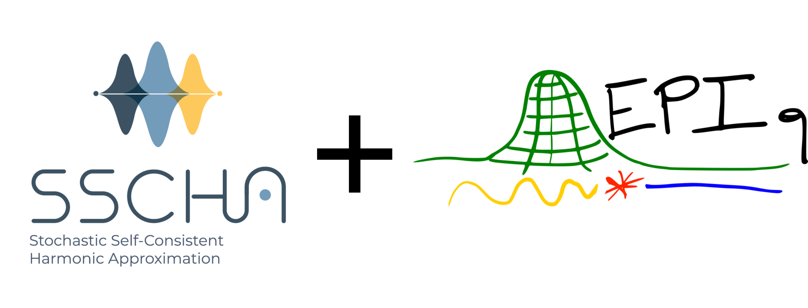
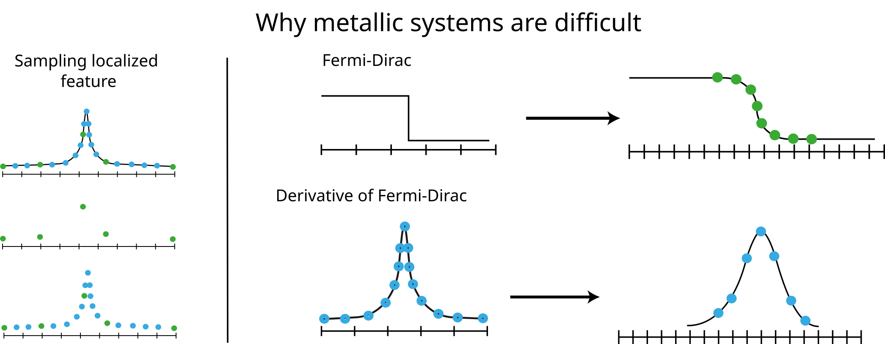
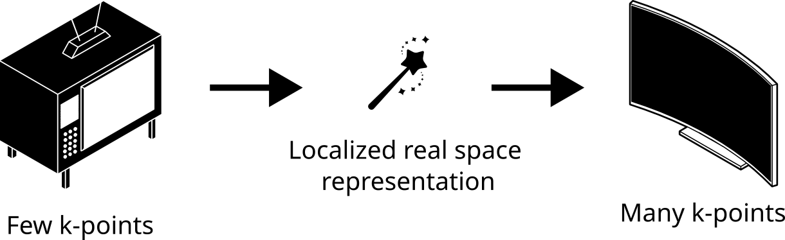
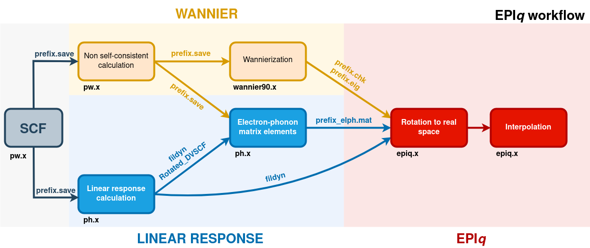
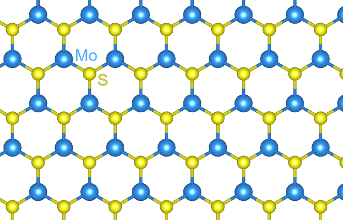
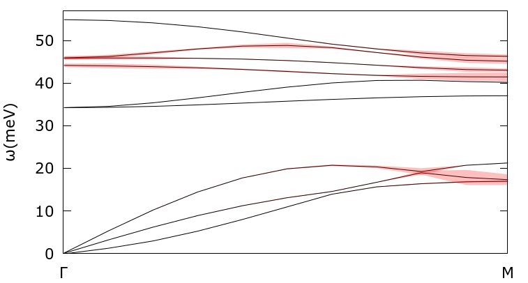
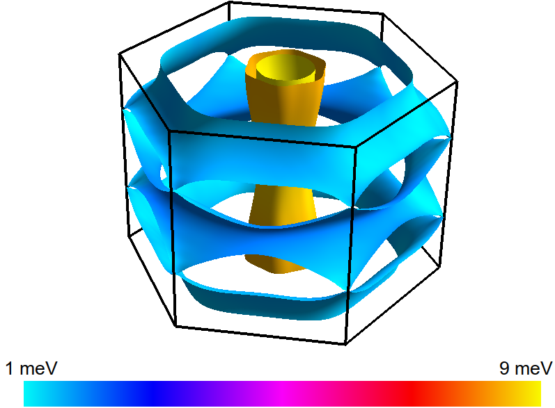

# Hands-on-session 5: EPIq - Anharmonicity in electron-phonon coupling related properties

## Introduction

In this hands-on session we learn how to include anharmonic effects
calculated within the SSCHA in the calculation of electron-phonon
coupling related properties using
[EPIq](https://the-epiq-team.gitlab.io/epiq-site/).

{width="600px"}

In some systems the first principles calculation of electron-phonon
coupling matrix elements can be demanding. EPIq (Electron-Phonon wannier
Interpolation over k and q-points) is an open-source software that
allows to speed up the calculation of electron--phonon coupling related
properties using the Wannier interpolation technique. Details on the
interpolation scheme can be found
[here](https://the-epiq-team.gitlab.io/epiq-site/docs/th_found). Within
EPIq, it is possible to include anharmonic corrections to the dynamical
matrices as calculated within the SSCHA.

## Requirements

In the interest of time, in this hands-on session the following starting
data are at your disposal:

1.  Electron-phonon matrix elements
    $g^{\nu}_{m,n}(\mathbf{k},\mathbf{q})$ computed from first
    principles.
2.  Wannier interpolation files which encode the trasformation to the
    optimally smooth subspace, $U_{mn}$ :
    $\ket{\mathbf{R}n} = \frac{1}{\sqrt{N_k^w}} \sum_{\bf k=1}^{N_k^w}\sum_{m=1}^{N_{\rm w}}e^{-i\mathbf{k}\cdot \mathbf{R}}U_{mn}(\mathbf{k})|\psi_{{\bf k}m}\rangle$
3.  Anharmonic dynamical matrices
    $D^{SCHA}_{\mu,\nu}(\mathbf{k},\mathbf{q})$.
4.  Harmonic dynamical matrices (as a reference)
    $D^{HARM}_{\mu,\nu}(\mathbf{k},\mathbf{q})$.

::: attention
::: title
Attention
:::

A folder prepared for you with these data for the present tutorial can
be downloaded [05_EPIq](https://insert_download_link.xyz) folder in the
shared cloud. Right click on `tutorial_data` on the navigation bar and
download the whole folder. It contains:

1.  The electron-phonon coupling matrix elements can be found in the
    `mat_elem` folder. Each file corresponds to a different
    $\mathbf{q}$-point in the first Brillouin zone.
2.  The `Wannier` folder contains the files `(.eig, .chk)`.
3.  The dynamical matrices are stored in the `dyn_mat` directory.
    `dynq*` files are harmonic
    ($D^{SCHA}_{\mu,\nu}(\mathbf{k},\mathbf{q})$) while
    `MoS2.Hessian.dyn*` are anharmonic dynamical matrices computed with
    the SSCHA code ($D^{SCHA}_{\mu,\nu}(\mathbf{k},\mathbf{q})$).

Place all the downloaded material where you intend to run the tutorial.
A suggested structure is for example:

``` console
```

handson_8/

:   | 

    \+ \-\-\-\-- epiq/ \| \| \| + \-\-\-\-- bin/ \| \| \| + \-\-\-\--
    src/ \| \| + \-\-\-\-- MoS2/ \| + \-\-\-\-- MoS2.eig \| + \-\-\-\--
    MoS2.chk \| + \-\-\-\-- mat_elem/ \| \| \| + \-\-\-\--
    MoS2_elph.mat.1_q\* \| + \-\-\-\-- dyn_mat/ \| + \-\-\-\-- dynq\*
    \| + \-\-\-\-- MoS2.Hessian.dyn\*
:::

## About EPIq

<figure>

<figcaption>Epiq site: <a
href="https://the-epiq-team.gitlab.io/epiq-site/">https://the-epiq-team.gitlab.io/epiq-site/</a>
<p>Epiq paper: <a
href="https://www.sciencedirect.com/science/article/pii/S0010465523002953">https://www.sciencedirect.com/science/article/pii/S0010465523002953</a></p></figcaption>
</figure>

The [Electron-Phonon Interpolation over q and k points]{.title-ref}
package exploits Wannier interpolation to obtain many proprieties in
solids. Bloch theorem allows to describe an infinite system in real
space with a continuum of Hamiltonian for different k-points in the
Brillouin zone.

The properties of a material refers to a certain observable averaged
over the sample.

Thanks to the Bloch theorem it is often convenient to perform the
average in the reciprocal k-space. In other words as a sum over the
whole Brillouin zone of the quantities defined at each k-point.

$$\langle O \rangle=\frac{1}{N_k}\sum_{\mathbf{k}} F_O(\mathbf{k})$$

The quality of the averaging depends on the finesse of the sampling
$N_k$ and of the smoothness of the integrand function $F_O(\mathbf{k})$
(a constant function is totally described with just one k-point).

{.align-center width="400px"}

Wannier interpolation is an efficient way to refined the Brillouin zone
sampling.

{.align-center
width="400px"}

### Calculations available in EPIq

1.  Adiabatic (static) and non-adiabatic (dynamic) force constant
    matrices.
2.  **Electron-phonon contribution to the phonon linewidth** and related
    quantities.
3.  Isotropic and **anisotropic Eliashberg equations**.
4.  Double Resonant Raman scattering.
5.  Electron lifetime and relaxation time.

### EPIq workflow

{.align-center width="100.0%"}

The core steps of any calculation employing EPIq are performed using the
main executable `epiq.x` and consists in two main stages.

1.  A preliminary step where electron-phonon coupling matrix elements
    and the Hamiltonian are Fourier-transformed to real space and
    written to file.
2.  The electron-phonon coupling matrix elements and the Hamiltonian are
    transformed back to reciprocal space to compute the property of
    interest at arbitrary k- and q- values.

### EPIq input file

The input file is divided in three namelists:

1.  [&control]{.title-ref}, specifying what calculation the code will
    perform
2.  [&electrons]{.title-ref}, specifying the electronic parameters of
    the property to be computed
3.  [&phonons]{.title-ref}, specifying the phonons parameters for the
    property to be computed

Finally, the last lines of the input indicates the electron momentum
(k-) and phonon momentum (q-) meshes on which the matrix elements are
interpolated to.

## Setup phase: how to setup a calculation with EPIq

{.align-center width="400px"}

In this tutorial we calculate electron-phonon coupling related
properties for doped monolayer ${\rm MoS}_2$, and evaluate the effect of
anharmonicity on them.

### Wannier interpolation

As explained in the previous section, any calculation within EPIq starts
with a preliminary stepreferred to as `dump`. During this step, the
Hamiltonian and the electron-phonon coupling matrix elements in real
space are computed and written to file, to be used in any subsequent
calculation. This step is performed only once. The input file is the
following:

``` fortran
&control
    dump_gR=.true.,
    prefix='MoS2',
    elphmat_dir="./mat_elem/"
  /
  &electrons
  /
  &phonons
    nq1=8,
    nq2=8,
    nq3=1,
  /
```

Notice, in particular, the following paramters:

-   `dump_gR` in the namelist `control` tell the program to save the
    auxiliary file containing the Hamiltonian and the electron-phonon
    coupling matrix elements in real space. Since we are not calculating
    any property of the system the namelist `electron` and `phonons` are
    essentially empty. Only `nq1,nq2,nq3` have to be supplied in order
    to specifie the q-points mesh where the input electron-phonon
    coupling matrix elements were computed (in this case, a 8x8x1
    q-grid).

::: note
::: title
Note
:::

In order to keep everything tidy you can use keep the el-ph matrix
elements in a separate folder and use the variable:

&control \> elphmat_dir=\"\<path-to-folder\>\"
:::

Run this preliminary calculation using:

``` console
mpirun -n <NPROC> {$path_to_epiq}/bin/epiq.x -inp dump.in > dump.out
```

After the dump has ended, some output files have been produced.

-   The output file is binary and named `G_and_H.bin` contains the
    Hamiltonian and the electron-phonon coupling matrix elements in the
    Wannier representation. If, however, `ascii_G_and_H=.true.` is added
    in the `&control` namelist then the produced output file is readable
    and is named `G_and_H.asc`.
-   .dat files containing the real space localization of the Hamiltonian
    and the electron-phonon coupling matrix elements.

### Check real space localization

If the Wannier transformation is well converged, the matrix elements are
optimally localized in real space. Always check their localization.

::: topic
**Test:**

Using the two-columns files:

> \"MoS2_gw_R_ph.mu\*.dat.pe_1\"
>
> :   $|R| \qquad \sum_{m,n} | g^{\nu}_{m,n}(0,\mathbf{R})|^2$
>
> \"MoS2_gw_R_el.mu\*.dat.pe_1\"
>
> :   $|r| \qquad \sum_{m,n} | g^{\nu}_{m,n}(\mathbf{r},0)|^2$

plot the averaged modulus of the electron-phonon matrix elements as a
function of the distance in real space $|R|$. Are they localized?
:::

## Exercise phase: calculation of electron-phonon coupling related properties for doped monolayer ${\rm MoS}_2$

Input example for phonon-electron linewidth calculation in monolayer
${\rm MoS}_2$
\"\"\"\"\"\"\"\"\"\"\"\"\"\"\"\"\"\"\"\"\"\"\"\"\"\"\"\"\"\"\"\"\"\"\"\"\"\"\"\"\"\"\"\"\"\"\"\"\"\"\"\"\"\"\"\"\"\"\"\"\"\"\"\"\"\"\"\"\"\"\"\"\"\"\"\"\"\"\"\"\"\"\"\"\"

Consider the follwoing input file for the phonon-electron linewidth
calculation $\gamma$ at the M-point of the Brillouin zone. The input
parameters are explained in detail in the [EPIq
manual](https://the-epiq-team.gitlab.io/epiq-site/docs/manual/) . Here
is the input file:

``` fortran
&control
  prefix='MoS2',
  calculation='ph_linewidth',
  read_dumped_gr=.true.,
  dump_gR=.false.,
  elphmat_dir="./mat_elem/"
  out2json=.true.
 /

 &electrons
      ngauss=0,
      sigma_min=0.01,
      sigma_max=0.05
      nsigma=5,
  /

  &phonons
      use_alternative_dyn=.true.
      prefix_alt_dyn='./dyn_mat/dynq'
      Fourier_interp_dyn=.true.,
      nq1=8,nq2=8,nq3=1,
  /

  k-points
  automatic
  4 4 1 0 0 0

  q-points
  crystal
  1
  0.5 0 0 1 ! M
```

The linewidth calculation is then started by:

``` console
mpirun -n <NPROC> {$path_to_epiq}/bin/epiq.x -inp lw.in > lw.out
```

Note that this calculation is done within the harmonic approximation, as
we are using the dynamical matrices indicated by the variable
`prefix_alt_dyn='./dyn_mat/dynq'`.

::: topic
**Exercise:**

Perfom a convergence study of the linewidth at $\mathbf{M}$ as function
of the smearing and the k-mesh density. What is the minimum temperature
at which the linewidth of the eighth mode is to be considered at
convergence with a k-mesh of 8x8x1 ? And of 12x12x1?
:::

::: topic
**Exercise:**

Which mode shows larger smearing dependence?
:::

#### Inclusion of anharmonicity

Now, we want to observe what changes with the inclusion of **anharmonic
effects**. To this aim, we need to correctly specify the prefix of the
Free-energy Hessian matrices calculated within the SSCHA using
`prefix_alt_dyn='./dyn_mat/MoS2.Hessian.dyn'`.

::: topic
**Exercise:**

Compute the linewidth at $\mathbf{q}=\mathbf{M}$ using anharmonic
dynamical matrix computed using SSCHA. Why does it seem like the first
and the second mode are exchanged with respect to the harmonic dynamical
matrices? What phonon mode(s) shows largest anharmonic correction?
:::

::: topic
**Exercise:**

Try to produce two plots of the whole phonon spectrum, comparing the
harmonic and the anharmonic result. Do you observe any differences?
:::

Tip: a plottable file can be obtained using the `linewidth_path.x`
post-processing tool. Here is an example input file:

> ``` fortran
> &input_lambda
>   prefix='MoS2'
>   lkp_sequential=.true.
>   sigma_min=0.01,
>   sigma_max=0.02,
>   nsigma=2,
>   chosen_sigma=0.01
> &end
>  3.159998   0.000000   0.000000
> -1.579999   2.736639   0.000000
>  0.000000   0.000000  19.141895
>  crystal
>  11
>  0.001 0 0 1
>  0.05 0 0 1
>  0.10 0 0 1
>  ...
>  ...
>  0.50 0 0 1
> ```

Notice the parameter `chosen_sigma`, which specifies what smearing will
be used to produce the plottable file, and the lattice parameters at the
end of the namelist. The post-processing is executed as follows:

``` console
{$path_to_epiq}/bin/linewidth_path.x < path.in > path.out
```

You can then use the following gnuplot script plots the q-resolved
linewidth for the acoustic modes:

> ``` none
> set ylabel '{/Symbol w}(meV)'
> set xlabel 'Gamma - M'
> set style fill transparent solid 0.25
> pl for [i=0:9] 'MoS2_lw_path.d' every 9::i u 1:2 w l lt rgb 'black' title ''
> repl  for [i=0:9] 'MoS2_lw_path.d' every 9::i u ($1):($2-$3/2):($2+$3/2)\
> w filledc lt rgb 'red' title ''
> ```

## Solution: Phonon linewidth calculation

Let\'s start again from the example file we considered for the
calculation for phonon of momentum $\mathbf{q}=\mathbf{M}$ for two
values of the electronic smearing.

``` fortran
&control
  prefix='MoS2',
  calculation='ph_linewidth',
  read_dumped_gr=.true.,
  dump_gR=.false.,
  elphmat_dir="./mat_elem/"
  out2json=.true.
 /

 &electrons
      ngauss=0,
      sigma_min=0.01,
      sigma_max=0.05
      nsigma=5,
  /

  &phonons
      use_alternative_dyn=.true.
      prefix_alt_dyn='./dyn_mat/dynq'
      Fourier_interp_dyn=.true.,
      nq1=8,nq2=8,nq3=1,
  /

  k-points
  automatic
  4 4 1 0 0 0

  q-points
  crystal
  1
  0.5 0 0 1 ! M
```

The phonon linewidth $\gamma_{\mathbf{q},\nu}$ in the double delta
(Allen) form is defined by the following equation:

$$\gamma_{\mathbf{q},\nu} = \frac{4 \pi \omega_{\mathbf{q},\nu}}{N_k}\sum_{m,n}\sum_{\mathbf{k}}|g^{\nu}_{m,n}(\mathbf{k},\mathbf{q})|^2\delta(\epsilon_{\mathbf{k}+\mathbf{q},m}-\epsilon_{F})\delta(\epsilon_{\mathbf{k},n}-\epsilon_{F})$$

where the electron-phonon coupling is defined from the deformation
potential as:

$$g^{\nu}_{m,n}(\mathbf{k},\mathbf{q}) = \sum_s\mathbf{e}^s_{\mathbf{q},\nu}\cdot\mathbf{d}^s_{m,n}(\mathbf{k},\mathbf{q})/\sqrt{2M_s\omega_{\mathbf{q},\nu}}$$

#### Parameters

> -   The linewidth calculation is selected by setting the `calculation`
>     parameter equal to `'ph_linewidth'` in the `&control` namelist.
> -   In the namelist `control`, `read_dumped_gr`, which is set to
>     `.true.`, indicating that electron-phonon coupling matrix elements
>     can be read from `G_and_H.bin` )
> -   In the namelist `electrons`, `sigma_min`, `sigma_max`, `ngauss`
>     and `nsigma` specify maximum, minimum, type and number of
>     electronic smearing values to use. `efermi` and `ef_from_input`
>     specify the initial guess for the Fermi level ( the Fermi level
>     calculated by Quantum ESPRESSO is usually a good guess) and
>     whether the Fermi level should be re-calculated by epiq (
>     `ef_from_input` equal to `.false.`) or set from input (
>     `ef_from_input` equal to `.true.`). The variable `thr_compute_k`
>     is used to restrict the calculation only to k-points possessing at
>     least one eigenvalue in the specified energy region near the Fermi
>     level.
> -   In the namelist `phonons`, `Fourier_interp_dyn` equal to `.true.`
>     asks to interpolate the dynamical matrices for the q-points that
>     do not belong to the Wannier grid. Alternatively, *EPIq* gives the
>     opportunity to read eigenvalues and eigenvectors produced by
>     `matdyn.x` of the Quantum ESPRESSO package (`matdyn.eig` file),
>     putting `Fourier_interp_dyn=.false.` and `read_modes=.true.` in
>     input, or even to directly read dynamical matrices from a
>     `matdyn.dyn` file, putting `Fourier_interp_dyn=.false.` and
>     `read_modes=.false.` .

#### Output files

If the `out2json` flat is set to `.true.`, the file `MoS2_lambda.json`
will be produced. It can be automatically parsed using python as in the
following lines where the variable `q_pts` is a \"dict\" whose entries
are the results of the calculation for each q-point.

``` python
import json
ff = './MoS2_lambda.json'
with open(ff,'r') as f:
    q_pts = json.load(f)

first_q = q_pts["1"]

print("Fraction coordinate of the q point:", first_q["xq_frac"])
print("Electronic temperaturs used:", first_q["T"])
print("Results for the first mode:", first_q["1"])
print("Frequency of the second mode in meV:", first_q["2"]["freq"])
```

Here, a simple python script to plot the linewidth esteemed with the
Allen formula:

``` python
import matplotlib.pyplot as plt
import numpy as np
for q in list(q_pts.values())[:]:
    for mod in range(1,10):
        plt.plot( q["T"],q[f'{mod}']["gamma_allen"],label=r"$\omega_"+f"{mod}$={q[f'{mod}']['freq']:.0f} (meV)",linestyle='--' )
    plt.xlabel('T  (eV)')
    plt.ylabel(r'$\gamma(T)$  (meV)')
    plt.legend(title=f"q={ np.round(np.array(q['xq_frac']),2) }")
    plt.show()
```

The other output file, `MoS2_lambda.d`, contains all the properties
calculated by EPIq. The way this file is formatted is specified in
output file, `lw.out`. Notice in particular that the first column
contains the electronic smearing, while the second column contains the
Allen linewidth.

#### Dispersion along a line

Now we want to perform the calculation of phonon linewidth along a
certain crystalline direction and produce a plot like this one:

{.align-center width="500px"}

where the thickness of the lines is proportional to the calculated
phonon linewidth. In order to to this, we repeat the phonon linewidth
calculation, this time considering the whole $\Gamma$ -M path:

> ``` fortran
> &control
>    dump_gR=.false.,
>    read_dumped_gr=.true.,
>    prefix='MoS2',
>    calculation='ph_linewidth',
>    elphmat_dir="./mat_elem/"
> &end
> &electrons
>    ngauss=0,
>    sigma_min=0.01,
>    sigma_max=0.02
>    nsigma=2,
> &end
> &phonons
>    use_alternative_dyn=.true.
>    prefix_alt_dyn='./dyn_mat/MoS2.Hessian.dyn'
>    Fourier_interp_dyn=.true.,
>    nq1=8,nq2=8,nq3=1,
> &end
> k-points
> automatic
> 8 8 1  0  0  0
> q-points
> crystal
> 11
> 0.001 0 0 1
> 0.05 0 0 1
> 0.10 0 0 1
> ...
> ...
> 0.50 0 0 1
> ```

Once the linewidth calculation has finished, we can obtain a plottable
file using the `linewidth_path.x` post-processing tool. Here is an
example of input file:

> ``` fortran
> &input_lambda
>   prefix='MoS2'
>   lkp_sequential=.true.
>   sigma_min=0.01,
>   sigma_max=0.02,
>   nsigma=2,
>   chosen_sigma=0.01
> &end
>  3.159998   0.000000   0.000000
> -1.579999   2.736639   0.000000
>  0.000000   0.000000  19.141895
>  crystal
>  11
>  0.001 0 0 1
>  0.05 0 0 1
>  0.10 0 0 1
>  ...
>  ...
>  0.50 0 0 1
> ```

Notice the parameter `chosen_sigma`, which specifies what smearing will
be used to produce the plottable file, and the lattice parameters at the
end of the namelist. The post-processing is executed as follows:

``` console
{$path_to_epiq}/bin/linewidth_path.x < path.in > path.out
```

## Advanced tutorial: Migdal-Eliashberg calculation using SSCHA Hessian matrices

*EPIq* also allows to solve the anisotropic Eliashberg equations on the
imaginary axis in order to calculate the $\mathbf{k}$-resolved
superconducting gap. We give an example for the superconducting gap of
doped monolayer $\textrm{MoS}_2$ at T= 1 K.

> ``` fortran
> &control
>     dump_gR=.false.,
>     read_dumped_gr=.true.,
>     prefix='MoS2',
>     calculation='migdal_eliashberg',
>     elphmat_dir="./mat_elem/"
>     &end
>     &electrons
>     theta=1,
>     efermi=-2.0,
>     ef_from_input=.false.,
> &end
> &phonons
>     use_alternative_dyn=.false.
>     prefix_alt_dyn='./dyn_mat/MoS2.Hessian.dyn'
>     read_modes=.false.,
>     nq1=8,
>     nq2=8,
>     nq3=1,
> &end
> &input_migdal
>     initialize='step',
>     gap_threshold=0.025,
>     sigma_me=0.1,
>     ME_Fermi_thickness=0.4,
>     mustar=0.1,
>     nmatsu=64,
>     nitermax=100,
>     alpha_mix_me=0.5,
>     gap_init=4.0,
> &end
> nkfs
> 64 64 1
> 40
> ```

Run the *EPIq* calculation as follows:

``` console
mpirun -n 4 {$path_to_epiq}/bin/epiq.x <input_ME > out_ME
```

Note that for the `migdal_eliashberg` calculation, the number of
$\mathbf{k}$-points (40 in this case) must be a multiple of the mpi
processes (4 in this case).

Notice the following parameters in the input file:

-   In the `&electrons` namelist, `theta=1.0` specifies the temperature
    of the calculation in Kelvin.
-   In the `&input_migdal` namelist, `sigma_me` specifies the broadening
    (in eV) to be used in the calculation and `ME_Fermi_thickness` the
    energy range around the Fermi level where electron eigenvalues are
    considered in the calculation. `nmatsu` indicates the number of
    Matsubara frequencies to be employed in the sum ( see
    [here](https://the-epiq-team.gitlab.io/epiq-site/docs/calc/eliash/)
    for further details: )
-   The code solves the equation generating a certain number of random
    $$$\mathbf{k}$-points, defined by the `64 64 1` grid in input and
    having an eigenvalue on the Fermi surface.

EPIq also calculates the Fermi surface using the grid specified after
`nkfs` (64 64 1 here). After EPIq is done, two output files are
produced:

-   MgB2.bxsf contains the Fermi surface in the XCrysDen .bxsf format.
-   MgB2_ME.d contains the Fermi-surface resolved Eliashberg gap.

You can produce a plot of the Fermi-surface resolved superconducting gap
using the `plot_ME_fs.x` post processing. Execute it as:

``` console
{$path_to_epiq}/bin/plot_ME_fs.x
```

This is, for example, what you get for ${\rm MgB}_2$, with its famous
double gap:

{width="600px"}

Try to obtain the same kind of plot for ${\rm MoS}_2$ using
[fermisurfer](https://mitsuaki1987.github.io/fermisurfer/) ([github
repository](https://github.com/mitsuaki1987/fermisurfer.git/)) typing:

``` console
fermisurfer MoS2.frmsf
```

::: topic
**Exercise:**

Perform a convergence study of the average superconducting gap as
function of the number of Matsubara frequencies and k-points. What is
the required value of nmatsu and k-points to have a precision better
than 0.1 meV?
:::

::: note
::: title
Note
:::

A complete calculation of anharmonic electron phonon coupling related
properties within SSCHA+EPIq requires the following steps:

1.  [The SSCHA code](http://sscha.eu/) $\rightarrow$ First, compute the
    free energy Hessian within the stochastic self-consistent harmonic
    approximation (SSCHA).
2.  [Quantum ESPRESSO code](https://www.quantum-espresso.org/)
    $\rightarrow$ Then, compute electron-phonon coupling matrix elements
    following the instructions reported in the EPIq site
    <https://the-epiq-team.gitlab.io/epiq-site/docs/tutorials/step1/>.
3.  [Wannier90 code](http://www.wannier.org/) $\rightarrow$ Identify the
    unitary transformation connecting the Bloch and the maximally-smooth
    gauge (required to interpolate the electron-phonon coupling matrix
    elements in the Wannier basis).
4.  [EPIq code](https://the-epiq-team.gitlab.io/epiq-site/)
    $\rightarrow$ Perform the electron-phonon copuling interpolation in
    the Wannier basis and calculate physical properties including the
    anharmonic correction from SSCHA.

All these open-source software can be downloaded following the
instruction in each website.

If you want to know more about the full procedure, please take a look at
the tutorials on the [EPIq
site.](https://the-epiq-team.gitlab.io/epiq-site/docs/tutorials/tutorials/)
:::
